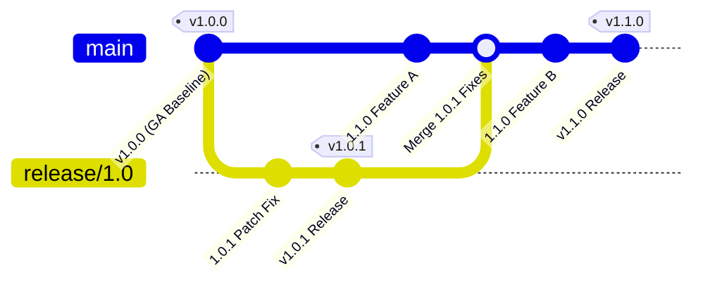

# Viet Template 1.x Compatibility Policy

> **Document Version:** 1.0.0  
> **Status:** Canonical Release Governance & Permanent Policy  
> **Applicability:** Viet Template 1.x Line (1.0.0 through 1.x minor/patch releases)  
> **Release Provenance Baseline:** 1.0.0 GA (`b951021e9975b8e8103b2402dc244b32a96afaa8`)  
> **Compiler & Classfile Target:** Java 21 (`--release 21`, bytecode classfile major version 65)  

---

## 1. Introduction & Canonical Compatibility Baseline

Viet Template 1.0.0 establishes the permanent, canonical, immutable compatibility baseline governing the entire Viet Template 1.x line.

### 1.1 Canonical Baseline Provenance

The compatibility baseline is permanently recorded in [`config/compatibility/1.0.0-compatibility-baseline.json`](config/compatibility/1.0.0-compatibility-baseline.json) and locked to the official 1.0.0 GA git release artifact:

| Attribute | Canonical Value |
| :--- | :--- |
| **Release Version** | `1.0.0` |
| **Release Tag** | `v1.0.0` |
| **Commit SHA** | `b951021e9975b8e8103b2402dc244b32a96afaa8` |
| **Tree SHA** | `87425fa306fb3b44ac6f6d435d79dfb95cd0a52a` |
| **Release Date** | `2026-09-26` |
| **Canonical Line** | `1.x` |

### 1.2 Core Compatibility Invariant

> **The 1.x Compatibility Invariant**:  
> Any valid template source, programmatic configuration, Java application consumer code, Service Provider Interface (SPI) implementation, or build-tool workflow compiled or executing against Viet Template 1.0.0 will continue to compile and execute without breaking changes or unintended behavioral divergence across all 1.x releases (1.0.x patch releases, 1.1.x minor versions, and all subsequent 1.x updates).

### 1.3 Machine-Checked Continuous Integration Enforcement

This compatibility guarantee is not merely aspirational; it is mechanically audited and enforced by automated continuous integration gates on every commit and pull request:
- `scripts/verify-compatibility-baseline.py`: Validates schema, git provenance, public surface counts, runtime ABI, diagnostic codes, entrypoints, contracts, and TCK features against the 1.0.0 baseline.
- `scripts/verify-api-compatibility.py`: Verifies binary and source compatibility across the 5 public API baseline manifests (`1.0-core-public-api.txt`, `1.0-aot-public-api.txt`, `1.0-spring-public-api.txt`, `1.0-spring-security-public-api.txt`, `1.0-quarkus-public-api.txt`).
- `scripts/verify-generated-abi.py`: Inspects constant pools of compiled template classfiles to ensure exact conformance with the 7-type, 22-method runtime ABI contract.
- `scripts/verify-public-surface-classification.py`: Confirms exact classification of all 339 public types and enforces zero signature leaks into stable surfaces.
- `scripts/verify-framework-entrypoints.py`: Validates reflection and service loader entrypoints against framework metadata.
- `scripts/verify-cross-module-contracts.py`: Prevents unregistered internal dependencies across repository modules.

---

## 2. Java API Compatibility

Viet Template governs its compiled types using a nine-category public surface taxonomy established in [ADR-0017](docs/adr/0017-public-surface-taxonomy-and-entrypoint-classification.md) and codified in [ADR-0020](docs/adr/0020-1.0-api-abi-freeze-and-rc-contract.md).

```text
┌─────────────────────────────────────────────────────────────────────────────┐
│                    Viet Template Public Surface Taxonomy                    │
├──────────────────────────────────────┬──────────────────────────────────────┤
│ Supported Stable Contracts (121)    │ Internal & Unstable Surfaces (218)   │
│ ├── STABLE_API (94 types)           │ ├── PUBLIC_BUT_INTERNAL (85 types)   │
│ └── STABLE_SPI (27 types)           │ ├── INTERNAL_CROSS_MODULE (59 types) │
│                                      │ ├── INTERNAL_CROSS_PACKAGE (57 types)│
│ Emerging Compiler Features          │ ├── FRAMEWORK_ENTRYPOINT (4 types)   │
│ └── EXPERIMENTAL (5 types)          │ ├── BUILD_TOOL_ENTRYPOINT (4 types)  │
│                                      │ ├── GENERATED_RUNTIME_ABI (1 type)   │
│                                      │ └── BENCHMARK_SUPPORT (3 types)      │
└──────────────────────────────────────┴──────────────────────────────────────┘
```

### 2.1 Classification Categories & Guarantees

1. **`STABLE_API` (94 Types)**:
   - **Audience**: Application developers integrating Viet Template into Java, Spring Boot, or Quarkus applications.
   - **Guarantee**: Strict binary and source backward compatibility across all 1.x releases.
   - **Rules**: Types, public methods, constructors, and fields cannot be removed, renamed, or modified in signature. New methods added to concrete classes or new classes added to packages must be purely additive.
   - **Signature Leak Rule**: `STABLE_API` signatures must never reference non-stable types (`INTERNAL`, `EXPERIMENTAL`, or `PUBLIC_BUT_INTERNAL_ACCIDENT`).
   - **Key Types**:
     - Engine & Templates: `io.github.minh124199.viettemplate.api.TemplateEngine`, `io.github.minh124199.viettemplate.api.Template`, `io.github.minh124199.viettemplate.api.CompiledTemplate`, `io.github.minh124199.viettemplate.vtl.engine.VtlTemplateEngine`.
     - Context & Execution: `io.github.minh124199.viettemplate.api.RenderContext`, `io.github.minh124199.viettemplate.api.RenderRequest`, `io.github.minh124199.viettemplate.api.TemplateId`, `io.github.minh124199.viettemplate.runtime.MapRenderContext`.
     - AOT Compiler: `io.github.minh124199.viettemplate.aot.TemplateAotCompiler`, `io.github.minh124199.viettemplate.aot.TemplateAotRequest`, `io.github.minh124199.viettemplate.aot.TemplateAotResult`.
     - Output & Escaping: `io.github.minh124199.viettemplate.runtime.SafeHtml`, `io.github.minh124199.viettemplate.runtime.SafeUrl`, `io.github.minh124199.viettemplate.runtime.StringTemplateOutput`.
     - Framework Views: `io.github.minh124199.viettemplate.spring.web.servlet.VietTemplateView`, `io.github.minh124199.viettemplate.spring.security.SecurityView`, `io.github.minh124199.viettemplate.spring.security.CsrfView`, `io.github.minh124199.viettemplate.quarkus.VietTemplateRenderer`.

2. **`STABLE_SPI` (27 Types)**:
   - **Audience**: Library extenders, framework integrators, and plugin developers creating custom repositories, security policies, formatters, or output sinks.
   - **Guarantee**: Binary and source backward compatibility across all 1.x releases.
   - **Rules**: Additive evolution is permitted exclusively via Java `default` methods with safe, documented fallback implementations. Adding abstract methods to existing SPI interfaces is strictly forbidden in 1.x.

3. **`EXPERIMENTAL` (5 Types)**:
   - **Audience**: Early adopters evaluating evolving compiler internals.
   - **Types**: `io.github.minh124199.viettemplate.language.vtl.parser.VtlParser`, `io.github.minh124199.viettemplate.language.vtl.parser.VtlParseResult`, `io.github.minh124199.viettemplate.language.vtl.parser.VtlParserOptions`, `io.github.minh124199.viettemplate.language.vtl.VtlFeatureState`, `io.github.minh124199.viettemplate.language.vtl.VtlFrontend`.
   - **Guarantee**: Explicitly exempt from 1.x compatibility guarantees. Signatures and behaviors may change across minor releases. All experimental types are annotated or documented with `@Experimental`.

4. **`PUBLIC_BUT_INTERNAL_ACCIDENT` (PBCIA) (85 Types)**:
   - **Origin**: Concrete AST nodes (41 types), IR expressions/statements (33 types), and semantics helpers (11 types) that are public solely due to cross-module package boundaries between `viet-template-language-vtl` and `viet-template-vtl-interpreter`.
   - **Quarantine & Invariants**: Quarantined in [`config/architecture/public-surface-debt-registry.json`](config/architecture/public-surface-debt-registry.json) with exactly **0 signature leaks** into `STABLE_API` or `STABLE_SPI`.
   - **Disposition**: Frozen against unintended changes; non-blocking P2 architectural debt deferred to post-1.0 modular restructuring (Milestone M22).

5. **`INTERNAL` (`INTERNAL_CROSS_MODULE`, `INTERNAL_CROSS_PACKAGE`, `BENCHMARK_SUPPORT_INTERNAL`) (119 Types)**:
   - **Guarantee**: Zero external compatibility promise. Private implementation details that may be restructured, relocated, or eliminated without notice.

6. **`FRAMEWORK_ENTRYPOINT` & `BUILD_TOOL_ENTRYPOINT` (8 Types)**:
   - **Types**: `VietTemplateRuntimeHints`, `VietTemplateSecurityRuntimeHints`, `VietTemplateProducer`, `VietTemplateProcessor`, `VietTemplateCompileMojo`, `VietTemplatePlugin`, `VietTemplateCompileTask`, `VietTemplateExtension`.
   - **Guarantee**: Class names and metadata registration contracts are stable for framework discovery. They are not intended as general application programming APIs.

### 2.2 Deprecation Policy

When an existing API or SPI member is superseded by an improved abstraction during the 1.x lifecycle:
1. **Annotation**: The element must be annotated with `@Deprecated(since = "1.x.y", forRemoval = false)` (or `true` if scheduled for removal in 2.0.0).
2. **Javadoc Documentation**: Javadoc must clearly describe the rationale for deprecation, the recommended alternative, and code examples demonstrating migration.
3. **Retention Invariant**: Deprecated elements must remain fully operational, binary-compatible, and source-compatible throughout the entire 1.x lifecycle.
4. **No Removal in 1.x**: Deprecated members or classes will **never** be removed in a minor or patch release. Physical removal is strictly reserved for the next major version (`2.0.0`).

---

## 3. Service Provider Interface (SPI)

Viet Template is designed with modular extension points that allow enterprise architectures to customize storage, output rendering, member access, and framework contextual bindings.

### 3.1 Supported Extension Points

| Extension Interface | Role | Module |
| :--- | :--- | :--- |
| `TemplateRepository` | Custom template loading from classpath, filesystem, database, or network | `viet-template-api` |
| `TemplateFreshnessProvider` | Validates template source currency and manages cache invalidation tokens | `viet-template-api` |
| `FreshnessToken` | Opaque token representing template source state across cache lookups | `viet-template-api` |
| `TemplateOutput` | Zero-allocation streaming output sinks (String, Stream, Writer, custom) | `viet-template-api` |
| `TemplateEngineProvider` | Service discovery provider loaded via `java.util.ServiceLoader` | `viet-template-api` |
| `MemberAccessPolicy` | Configurable property/method access rules and sandbox security policies | `viet-template-api` |
| `LinkerAccessPolicy` | Dynamic call-site linkage access controls for inline cache dispatching | `viet-template-runtime` |
| `RenderContextContributor` | Framework metadata bridges injecting variables into render context | `viet-template-api` |
| `VietTemplateEngineCustomizer` | Programmatic builder customizer for Spring Boot environments | `viet-template-spring` |
| `SecurityViewFactory` | Customizes construction of `$security` views in Spring Security | `viet-template-spring-security` |
| `CsrfViewFactory` | Customizes construction of `$csrf` views in Spring Security | `viet-template-spring-security` |
| `Escaper` & `SafeContent` | Custom output escaping strategies for specialized document formats | `viet-template-runtime` |

### 3.2 SPI Evolution Contract

To ensure third-party implementations of SPI interfaces remain unbroken when new capabilities are introduced in 1.x:
- **Default Methods Only**: Any new method added to an existing SPI interface (such as `TemplateRepository` or `TemplateOutput`) must be declared as a `default` method providing a functional, non-breaking fallback.
- **Prohibition on Abstract Additions**: Adding an abstract method to an existing SPI interface breaks binary compatibility with existing implementors, causing `AbstractMethodError` at runtime. This is strictly prohibited in 1.x.
- **New SPI Interfaces**: Entirely new SPI interfaces may be introduced additively in minor versions (e.g. `1.1.0`).

---

## 4. Template Language Semantics

Viet Template provides high-fidelity syntax and runtime compatibility with the Velocity Template Language (VTL) specification while enforcing strict virtual-thread invariants and memory limits.

### 4.1 Syntax and Grammar Invariants

- **Grammar Freeze**: The VTL grammar implemented in the lexer and parser is permanently frozen for 1.x.
- **No Silent Reinterpretation**: Templates that parse and render correctly under Viet Template 1.0.0 must never be reinterpreted with different syntax semantics or rejected by any subsequent 1.x release.
- **Language Feature Coverage**: All 80 language features verified in `config/tck/vtl-feature-matrix.json` and documented in [docs/migration/compatibility-matrix.md](docs/migration/compatibility-matrix.md) are guaranteed across 1.x.

### 4.2 Deterministic Evaluation Order

- **AST Traversal**: Evaluation proceeds left-to-right, top-to-bottom across directive blocks, expressions, and statements.
- **Directive Invocations**: Macro call-site arguments are evaluated deterministically in left-to-right positional order.
- **Short-Circuit Logic**: Logical AND (`&&`) and logical OR (`||`) operators guarantee short-circuit evaluation: if the left operand determines the outcome, the right operand is never evaluated.

### 4.3 Null & Undefined Variables

Viet Template enforces a deterministic **Three-State Evaluation Model** ([docs/language/undefined-null-semantics.md](docs/language/undefined-null-semantics.md)):
1. `UNDEFINED`: The reference key does not exist in any context or local scope.
2. `DEFINED_NULL`: The key exists with an explicit `null` value.
3. `DEFINED_VALUE`: The key binds to a non-null object.

#### Undefined Reference Policies (`UndefinedReferencePolicy`)

| Policy | Behavior on `UNDEFINED` Reference | Behavior on `$!quiet` Reference |
| :--- | :--- | :--- |
| `SILENT` | Renders literal identifier (e.g. `$missing` -> `"$missing"`). | Renders empty string (`""`). |
| `WARN` | Emits diagnostic warning; renders literal identifier. | Renders empty string (`""`). |
| `ERROR` | Halts execution immediately; throws `TemplateRenderException` with code `INTERPRETER:VARIABLE_UNDEFINED`. | Renders empty string (`""`). |

- **Safe Chained Navigation**: Chained expressions such as `$user.address.street` evaluate safely to `UNDEFINED` without throwing `NullPointerException` if any intermediate property evaluates to `UNDEFINED` or `DEFINED_NULL`.

### 4.4 Lexical Scoping and Iteration Invariants

Viet Template implements stack-oriented lexical execution frames ([docs/language/foreach-and-scopes.md](docs/language/foreach-and-scopes.md)):
- **Root Context Immutability**: The caller's `RenderContext` is immutable from within templates. Template `#set` statements write exclusively to local template execution frames; host model attributes are never modified.
- **`#foreach` Scoping & Shadowing**:
  - The loop variable (`$item`) and loop metadata (`$foreach`) are confined strictly to the loop body.
  - If a loop variable shares the name of an outer variable, the outer variable is shadowed during iteration and fully restored after loop exit without leakage.
- **Loop Metadata (`$foreach`) Contract**:
  - `$foreach.index`: 0-based iteration index (`0, 1, 2, ...`).
  - `$foreach.count`: 1-based iteration counter (`1, 2, 3, ...`).
  - `$foreach.first`: `true` during the initial iteration; otherwise `false`.
  - `$foreach.last`: `true` during the final iteration; otherwise `false`.
  - `$foreach.hasNext`: `true` if subsequent elements remain; otherwise `false`.
  - `$foreach.parent`: References outer loop metadata in nested loops; `null` at root.
  - `$foreach.topmost`: References the outermost loop metadata in deeply nested structures.
  - `$foreach.stop()`: Programmatic loop termination extension (`EXT-001`).
- **Macro Parameter Isolation**: Macro formal parameters and assignments inside macro bodies are isolated in an independent invocation frame and never overwrite outer variables.

### 4.5 Contextual Escaping & Output Safety

- **Contextual Escaping**: Viet Template automatically escapes interpolated variables based on the active output context (`HTML_TEXT`, `HTML_ATTRIBUTE_QUOTED`, `URL_COMPONENT`, `RAW`).
- **Safe Wrappers**: Plain strings are escaped by default in HTML contexts. Only explicit trusted capability wrappers (`SafeHtml`, `SafeUrl`) bypass auto-escaping in their designated target contexts.

### 4.6 Expression Evaluation Invariants

- **Truthiness Rules (`VtlTruthiness`)**: Evaluation in `#if` conditions matches the canonical priority:
  1. `null` or `UNDEFINED` -> `false`.
  2. `java.lang.Boolean` -> boolean value.
  3. `getAsBoolean()` method -> boolean result.
  4. Empty checks (Array length 0, empty CharSequence, empty Collection, empty Map, numeric 0) -> `false`.
  5. Any other non-null Object -> `true`.
- **Dynamic Dispatch**: Member access through polymorphic inline caches (`DynamicCallSite`) adheres to standard JavaBean getter resolution and Java Record component access rules.

---

## 5. Diagnostic Contracts

Diagnostic codes emitted by the Viet Template parser, semantic analyzer, compiler, and runtime are machine-readable identifiers designed for log indexing, metrics aggregation, and programmatic error handling.

### 5.1 Canonical 31 Diagnostic Codes Baseline

All 31 canonical codes registered in [`config/api-baseline/diagnostic-codes-1.0.txt`](config/api-baseline/diagnostic-codes-1.0.txt) are permanently locked for 1.x:

```text
COMPILER:CODEGEN_ERROR
CONTEXT:COLLISION
INTERPRETER:ERROR
INTERPRETER:INVALID_METHOD
INTERPRETER:INVALID_PROPERTY
INTERPRETER:VARIABLE_UNDEFINED
LAYOUT:CYCLE_DETECTED
LAYOUT:DEPTH_EXCEEDED
LIMIT:AST_NODE_LIMIT
LIMIT:LIMIT_EXCEEDED
LIMIT:SOURCE_TOO_LARGE
LIMIT:TIME_LIMIT_EXCEEDED
RENDER:IO_ERROR
RESOURCE:NOT_FOUND
SECURITY:ACCESS_DENIED
SECURITY:COMPILATION_REJECTED
SECURITY:MALFORMED_GLOBAL_MACRO_LIBRARY
SECURITY:PROTECTED_VARIABLE
SECURITY:VIOLATION
SYNTAX:PARSE_ERROR
VTLAOT:1001
VTLAOT:1101
VTLAOT:1102
VTLAOT:1201
VTLS:2101
VTLS:2102
VTLS:2103
VTLS:2104
VTLS:2105
VTLS:2106
VTLSEC:2401
```

### 5.2 Diagnostic Permanence & Evolution Policy

- **No Removal or Renumbering**: No diagnostic code in this baseline may be deleted, renamed, or renumbered throughout 1.x.
- **Additive Codes**: New diagnostic codes may be introduced in minor releases (`1.1.0`, etc.) under approved namespaces:
  - `VTLP`: Parser & lexer diagnostics.
  - `VTLS`: Semantic analysis diagnostics.
  - `VTLSEC`: Security policy and sandbox violations.
  - `VTLC`: Compiler diagnostics.
  - `VTLR`: Runtime evaluation diagnostics.
  - `VTLAOT`: Ahead-Of-Time precompilation diagnostics.
  - `VTLSPR`: Spring Framework integration diagnostics.
- **Message Phrasing**: Human-readable English message phrasing may be clarified or refined across releases, but machine-readable categories and string codes remain strictly invariant.
- **Deprecated Codes**: If a specific condition becomes obsolete, its code remains registered in the catalog and will not be reassigned to a different error.

---

## 6. Generated Code & Runtime ABI

Ahead-Of-Time (AOT) compilation translates declarative VTL templates into Java 21 bytecode (`.class` files) during build time. The binary linkage between generated template bytecode and the engine runtime constitutes the **Runtime ABI**.

### 6.1 Separation of Templates and Bytecode

- User templates remain declarative source files (`.vtl`, `.vm`).
- AOT classfiles implement `CompiledTemplate` and contain constant-pool symbolic references to engine runtime bridge methods.

### 6.2 Frozen Runtime ABI Contract (ADR-0016, ADR-0020)

The generated template runtime ABI is permanently locked to exactly **7 types, 22 invoked methods, and 0 fields** in [`config/api-baseline/generated-template-runtime-abi.txt`](config/api-baseline/generated-template-runtime-abi.txt):

1. `io.github.minh124199.viettemplate.api.CompiledTemplate`:
   - `public abstract TemplateId id()`
   - `public abstract void render(RenderContext, TemplateOutput)`
2. `io.github.minh124199.viettemplate.api.RenderContext`:
   - `public abstract Object get(String)`
3. `io.github.minh124199.viettemplate.api.TemplateId`:
   - `public static TemplateId of(String)`
4. `io.github.minh124199.viettemplate.api.TemplateOutput`:
   - Opaque sink parameter passed to template render methods.
5. `io.github.minh124199.viettemplate.language.vtl.semantics.scope.ForeachMetadata`:
   - `public abstract int getCount()`
   - `public abstract int getIndex()`
   - `public abstract boolean isFirst()`
   - `public abstract boolean isLast()`
6. `io.github.minh124199.viettemplate.runtime.linker.DynamicCallSite`:
   - Opaque call-site token passed to `BytecodeRuntimeBridge` dynamic dispatchers.
7. `io.github.minh124199.viettemplate.vtl.compiler.bytecode.BytecodeRuntimeBridge`:
   - 16 static runtime bridge methods: `binaryOp`, `countLoopIteration`, `createCallSite`, `createForeachMetadata`, `createLoopState`, `dynamicGetIndex`, `dynamicGetProperty`, `dynamicInvokeMethod`, `isTruthy`, `rangeIterator`, `recordContextVariable`, `toIterator`, `toUtf8Bytes`, `unaryOp`, `writeConst`, `writeValue`.

### 6.3 Model D Forward Compatibility Guarantee (ADR-0016)

Under **Model D** compatibility:
- **1.0.0 Forward Compatibility**: Any `.class` file compiled by the Viet Template 1.0.0 AOT compiler toolchain will run without recompilation on any subsequent 1.x runtime engine.
- **Recompilation Supported**: Recompilation across minor versions is supported and enabled by default in build tooling during project builds, but existing binaries continue to execute cleanly.
- **No Signature Breaks**: Modifying descriptors or deleting any of the 22 bridge methods is strictly prohibited in 1.x.

---

## 7. Maven Build Plugin

The official Maven plugin compiles templates into bytecode during the standard Maven build lifecycle.

- **Artifact Coordinates**: `io.github.minh124199:viet-template-maven-plugin`
- **Default Goal**: `compile`
- **Default Lifecycle Phase**: `process-classes` (runs after Java compilation so domain models are on the compilation classpath)

### 7.1 Configuration Parameters & Defaults

| Parameter | Type | Default Value | Property / CLI Override | Description |
| :--- | :--- | :--- | :--- | :--- |
| `sourceDirectory` | `File` | `src/main/viet-template` | `-Dviet-template.sourceDirectory` | Root directory containing template sources. |
| `outputDirectory` | `File` | `target/classes` | `-Dviet-template.outputDirectory` | Output directory for compiled `.class` bytecode files. |
| `resourceOutputDirectory` | `File` | `target/classes` | `-Dviet-template.resourceOutputDirectory` | Output directory for `templates.idx` registration index. |
| `encoding` | `String` | `UTF-8` | `-Dviet-template.encoding` | Character encoding of template source files. |
| `packagePrefix` | `String` | `io.github.minh124199.viettemplate.generated` | `-Dviet-template.packagePrefix` | Java package prefix for generated template classes. |
| `includes` | `List<String>` | `[**/*.vtl, **/*.vm]` | `-Dviet-template.includes` | Glob patterns of template files to compile. |
| `excludes` | `List<String>` | `[]` | `-Dviet-template.excludes` | Glob patterns of template files to exclude. |
| `failOnWarning` | `boolean` | `false` | `-Dviet-template.failOnWarning` | Fails build if template compilation emits warnings. |
| `incremental` | `boolean` | `true` | `-Dviet-template.incremental` | Enables SHA-256 fingerprint tracking for incremental builds. |
| `skip` | `boolean` | `false` | `-Dviet-template.skip` | Skips plugin execution. |

### 7.2 Incremental Build Invariants

- **Fingerprint Tracking**: Computes SHA-256 hashes of template source contents. Unmodified templates are skipped on subsequent runs.
- **Stale Output Deletion**: Deleting a template source file automatically prunes its corresponding `.class` file and updates `templates.idx`.

---

## 8. Gradle Build Plugin

The official Gradle plugin provides idiomatic build-time AOT template compilation with Gradle 8.5+ and 9.x compatibility.

- **Plugin ID**: `io.github.minh124199.viet-template`
- **Extension DSL**: `vietTemplate { ... }`
- **Task**: `compileVietTemplates` (type: `VietTemplateCompileTask`, described as `vietTemplateCompile`)

### 8.1 Extension Configuration DSL

```kotlin
vietTemplate {
    sourceDirectory.set(file("src/main/viet-template"))
    outputDirectory.set(layout.buildDirectory.dir("generated/viet-template/classes"))
    resourceOutputDirectory.set(layout.buildDirectory.dir("generated/viet-template/resources"))
    packagePrefix.set("io.github.minh124199.viettemplate.generated")
    encoding.set("UTF-8")
    includes.set(listOf("**/*.vtl", "**/*.vm"))
    excludes.set(emptyList())
    failOnWarning.set(false)
    incremental.set(true)
}
```

### 8.2 Task Wiring & Caching Invariants

- **Task Type**: `@CacheableTask` `VietTemplateCompileTask`.
- **Incremental & Cacheable**: Uses annotated `@InputDirectory`, `@OutputDirectory`, and `@PathSensitive(PathSensitivity.RELATIVE)` properties to support the Gradle Build Cache.
- **Configuration Cache**: Fully compatible with the Gradle Configuration Cache (`--configuration-cache`). Uses Gradle provider APIs without project state capture.
- **SourceSet Integration**: Automatically registers task output directories into `sourceSets.main.output.dir` and `sourceSets.main.resources.srcDir`.
- **Dependency Ordering**: Automatically configures `dependsOn(compileJava)` and wires `classes.dependsOn(compileVietTemplates)`.

---

## 9. Spring Framework Integrations

Viet Template provides first-class, enterprise-ready integrations across the Spring ecosystem ([docs/spring/spring-boot-integration.md](docs/spring/spring-boot-integration.md), [docs/36-spring-security-integration.md](docs/36-spring-security-integration.md)).

### 9.1 Dual Framework Baseline

Viet Template supports a dual enterprise framework baseline:

| Framework Stack | Minimum Declared | Tested & Qualified Baseline | Canonical CI Target |
| :--- | :--- | :--- | :--- |
| **Spring Framework** | `6.1.0` | `6.1.14`, `7.0.9` | `7.0.9` |
| **Spring Boot** | `3.3.0` | `3.3.5`, `4.1.1` | `4.1.1` |
| **Spring Security** | `6.3.0` | `6.3.4`, `6.5.11`, `7.0.7`, `7.1.1` | `7.1.1` |
| **Jakarta Servlet** | `6.0.0` | `6.0.0` (Tomcat 10.1), `6.1.0` (Tomcat 11.0) | `6.1.0` (Tomcat 11.0.24) |
| **JVM Runtime** | Java 21 | Java 21 LTS, Java 25 | Java 25 |

### 9.2 View Resolution & Auto-Configuration

- **`VietTemplateViewResolver`**: Resolves logical view names to template identifiers. Supports single-suffix (`viet-template.suffix`) and multi-suffix probing (`viet-template.suffixes`), order priority (`viet-template.order`), and view caching.
- **`VietTemplateAutoConfiguration`**: Configures `TemplateEngine`, `VietTemplateViewResolver`, and customizer hooks using `@ConditionalOnClass` and `@ConditionalOnMissingBean`.
- **Customization Hook**: Applications register `VietTemplateEngineCustomizer` beans to modify the engine builder programmatically.

### 9.3 Spring Security Integration Invariants

- **Single Artifact**: A single artifact (`viet-template-spring-security`) supports Spring Security 6.3+ through 7.x without multi-release JARs or version-specific shims.
- **Presentation-Safe Facades**: Exposes `$security` (`SecurityView`) and `$csrf` (`CsrfView`) in template render contexts.
- **Auto-Escaping Defense**: Facades return plain Java `String` (never `SafeHtml`), ensuring standard VTL contextual escaping renders untrusted principals and authorities securely without XSS bypasses.
- **Sensitive Token Redaction**: `CsrfView.toString()` strictly redacts token secrets (`token=***`) to prevent accidental credential leakage in logs.
- **Presentation-Only Warning**: `$security` helpers conditionally control visual UI elements only; they do not replace server-side access controls (`@PreAuthorize`, security filter chains).
- **Native AOT Hints**: Ahead-of-Time hints registered via `VietTemplateRuntimeHints` and `VietTemplateSecurityRuntimeHints` enable reflection-free execution on GraalVM Native Image.

### 9.4 Configuration Properties Namespace Stability

All 15 configuration properties under the `viet-template.*` namespace are permanently stable across 1.x:

| Property | Type | Default Value | Role |
| :--- | :--- | :--- | :--- |
| `viet-template.enabled` | `boolean` | `true` | Enables or disables auto-configuration. |
| `viet-template.prefix` | `String` | `""` | View name prefix (e.g. `templates/`). |
| `viet-template.suffix` | `String` | `""` | Primary view suffix (e.g. `.vtl`). |
| `viet-template.suffixes` | `List<String>` | `[]` | Ordered list of template suffixes to probe. |
| `viet-template.content-type` | `String` | `text/html;charset=UTF-8` | Content-Type HTTP response header. |
| `viet-template.charset` | `Charset` | `UTF-8` | Character encoding for template output. |
| `viet-template.cache` | `boolean` | `true` | Enables view resolver caching. |
| `viet-template.check-template-location` | `boolean` | `true` | Verifies template resource location at startup. |
| `viet-template.runtime-compilation-enabled` | `boolean` | `true` | Allows dynamic runtime compilation (disable in prod). |
| `viet-template.max-cache-entries` | `int` | `500` | Maximum compiled templates in memory cache. |
| `viet-template.negative-cache-ttl-millis` | `long` | `5000` | Negative cache TTL (ms) for missing templates. |
| `viet-template.hot-reload` | `boolean` | `false` | Enables filesystem watcher for local development. |
| `viet-template.watch-debounce-millis` | `long` | `50` | Debounce window (ms) for filesystem events. |
| `viet-template.order` | `int` | `LOWEST_PRECEDENCE` | View resolver priority order. |
| `viet-template.security.enabled` | `boolean` | `true` | Enables Spring Security context contributor. |

---

## 10. Quarkus Integration

Viet Template provides native integration with Quarkus 3.33+ (canonical 3.39.4+) ([docs/extensions/quarkus.md](docs/extensions/quarkus.md)).

- **Runtime Artifact**: `io.github.minh124199:viet-template-quarkus`
- **Deployment Artifact**: `io.github.minh124199:viet-template-quarkus-deployment`

### 10.1 Build-Time AOT & Native Image Compilation

- **Augmentation Processor**: `VietTemplateProcessor` executes during Quarkus build time to scan template directories, compile VTL templates to bytecode via `TemplateAotCompiler`, and generate `META-INF/viet-template/templates.idx`.
- **GraalVM Native Image Metadata**: Emits `GeneratedClassBuildItem`, `ReflectiveClassBuildItem`, and `NativeImageResourceBuildItem` ensuring seamless compilation to GraalVM Native Images.
- **Empirical Native Qualification**: Verified on Linux x86_64 Mandrel 25.0.4.1-Final with sub-20ms startup and zero reflection at runtime.

### 10.2 CDI Injection & Execution

- **`@Inject TemplateEngine`**: Injects the core engine configured for Quarkus application scope.
- **`@Inject VietTemplateRenderer`**: Injects high-level helper for string rendering and non-blocking `StreamingOutput` HTTP streaming.
- **Quarkus Security Integration**: Automatically binds `$security` (`QuarkusSecurityView`) when `quarkus-security` is present on the classpath.
- **Coexistence with Qute**: Viet Template operates harmoniously alongside Quarkus Qute without bean conflicts or template path interference.

---

## 11. Security Policy & Linker Isolation

Viet Template is built on a **secure-by-default, fail-closed** security architecture ([SECURITY.md](SECURITY.md)).

### 11.1 Inviolable Security Invariants

- **Non-Weakening Principle**: Security checks, sandbox policies, and member access controls must never be bypassed, weakened, or disabled for performance optimizations.
- **Native Image Parity**: Substrate VM GraalVM native image execution enforces identical `LinkerAccessPolicy` and sandbox invariants as the standard JVM runtime.
- **Explicit Exceptions**: Denied member accesses throw immediate `TemplateSecurityException` with diagnostic code `SECURITY:ACCESS_DENIED`. Denials are never masked or silently swallowed.

### 11.2 Blacklisted Reflection & System Targets

The dynamic linker and member access policies strictly prohibit access to the following classes and packages:

1. **Reflection & Dynamic Introspection**:
   - `java.lang.Class` (calls to `.class` and `.getClass()` are blocked by default via `security.denial.class-property` and `security.denial.get-class-method`).
   - `java.lang.ClassLoader`
   - `java.lang.reflect.*` (`Method`, `Field`, `Constructor`, `Array`, etc.)
   - `java.lang.invoke.*` (`MethodHandle`, `MethodHandles`, `VarHandle`, etc.)
2. **Process Execution & System Control**:
   - `java.lang.Runtime`
   - `java.lang.ProcessBuilder`
   - `java.lang.System` (e.g. `exit`, `gc`, `load`, `setSecurityManager`)
   - `java.lang.Thread`, `java.lang.ThreadGroup`
3. **Internal & Platform Packages**:
   - `sun.*`
   - `jdk.internal.*`
   - `java.security.*`
   - `org.graalvm.*`

---

## 12. SemVer & Release Policy

Viet Template strictly adheres to [Semantic Versioning 2.0.0](https://semver.org/).

### 12.1 Release Classification

```text
       MAJOR.MINOR.PATCH
         │     │     │
         │     │     └── Bug fixes, security patches, documentation (1.0.1, 1.0.2)
         │     └──────── Backward-compatible features, additive SPIs, diagnostics (1.1.0, 1.2.0)
         └────────────── Breaking changes, syntax evolution, removal of deprecations (2.0.0)
```

1. **Patch Releases (`1.0.x`)**:
   - **Contents**: Bug fixes, critical security remediations, documentation updates, performance improvements without API/ABI changes, and non-breaking corrections.
   - **Guarantee**: Complete backward compatibility with 1.0.0. No new features, API additions, or configuration keys.
2. **Minor Releases (`1.1.x`, `1.2.x`, etc.)**:
   - **Contents**: Backward-compatible new features, opt-in behaviors, additive SPI default methods, additional diagnostic codes, performance optimizations, and new framework integrations.
   - **Guarantee**: Complete backward compatibility with 1.0.0. All existing templates, configurations, and binaries continue to function unchanged.
3. **Major Releases (`2.0.0`)**:
   - **Contents**: Reserved for breaking changes, minimum JDK baseline increases (e.g. Java 25 minimum), retirement and removal of deprecated APIs, modular encapsulation of PBCIA debt, or major syntax revisions.

---

## 13. Maintenance Line Strategy (1.0.x)

To balance ongoing feature development with rock-solid production stability, Viet Template employs a dual-branch release engineering strategy:



### 13.1 Branch Roles & Workflow

1. **`main` Branch**:
   - Tracks ongoing 1.1 development.
   - Receives additive, backward-compatible features and performance optimizations.
2. **`release/1.0` Maintenance Branch**:
   - Created on demand directly from the `v1.0.0` release tag:
     ```bash
     git checkout -b release/1.0 v1.0.0
     ```
   - Dedicated exclusively to critical bug fixes, security patches, and qualification verification for the `1.0.x` maintenance line.
   - Validated against the canonical 1.0.0 baseline (`config/compatibility/1.0.0-compatibility-baseline.json`).
3. **Cherry-Pick & Reconciliation**:
   - Every fix committed to `release/1.0` is immediately cherry-picked or merged back into `main` to guarantee that patch fixes are never regressed in subsequent minor releases.
4. **CI Matrix Enforcement**:
   - Both `release/1.0` and `main` execute full baseline audits (`scripts/verify-compatibility-baseline.py`) to prevent contract drift.
