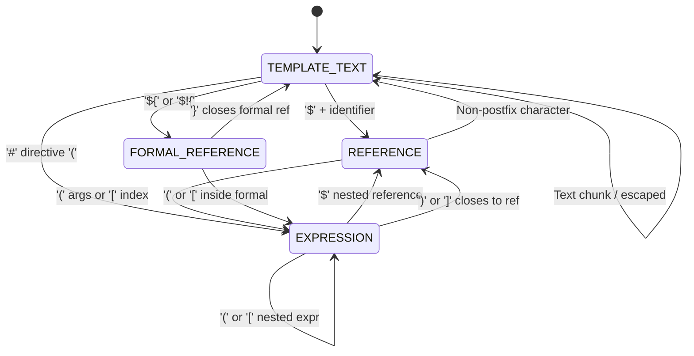

# 03a — VTL Lexer & Source Model Design

This document specifies the technical design, source coordinate system, token architecture, state machine modes, escaping semantics, and error recovery policies for the **Viet Template** VTL lexical analysis layer (`viet-template-language-vtl`).

---

## 1. Source Text Model & Coordinates

### 1.1 UTF-16 Indexing Strategy
To align with the JVM memory model and `java.lang.String` representation, all source offsets are zero-indexed half-open intervals `[startOffset, endOffset)` in UTF-16 code units:
- `startOffset`: The index of the first UTF-16 code unit belonging to the token/span (inclusive).
- `endOffset`: The index immediately following the last code unit (exclusive).
- `length = endOffset - startOffset`.

This design ensures zero-copy string slice recovery via `String.substring(start, end)` without O(N) conversions or surrogate pair re-indexing during scanning.

### 1.2 Line & Column Calculation
Line starts are indexed once upon creation of `SourceText` into an immutable `int[] lineStarts` array:
- `lineStarts[0] = 0`.
- Scanned in a single forward pass:
  - `\n` (LF): Records line break at `offset + 1`.
  - `\r\n` (CRLF): Single logical line break, advancing 2 code units and recording `offset + 2`.
  - `\r` (isolated CR): Records line break at `offset + 1`.
- Fast coordinate queries in $O(\log L)$ time using `Arrays.binarySearch(lineStarts, offset)`:
  - `line = insertionPoint + 1` (1-based).
  - `column = offset - lineStart + 1` (1-based).

---

## 2. Token Architecture & Zero Eager Allocations

### 2.1 Compact Token Representation
Every token is an immutable Java record:
```java
public record VtlToken(VtlTokenKind kind, SourceSpan span)
```
- `VtlToken` does **not** store an eagerly allocated `String` containing the token's text.
- Literal and text tokens refer directly to the underlying `SourceText` via their `SourceSpan`.
- Token text is lazily extracted only when needed (e.g. during AST construction, debugging, or code generation) via `token.text(source)`.

### 2.2 Token Kinds
The lexer categorizes source units into 40 distinct `VtlTokenKind` classifications:
- **Text & Raw**: `TEXT` (contiguous template text chunks), `RAW_TEXT` (`#[[ ... ]]#`).
- **Introducers & Sigils**: `DOLLAR` (`$`), `HASH` (`#`), `BANG` (`!`), `PIPE` (`|`).
- **Delimiters**: `LEFT_PAREN` (`(`), `RIGHT_PAREN` (`)`), `LEFT_BRACE` (`{`), `RIGHT_BRACE` (`}`), `LEFT_BRACKET` (`[`), `RIGHT_BRACKET` (`]`), `DOT` (`.`), `COMMA` (`,`), `COLON` (`:`).
- **Operators**: `EQUAL` (`=`), `EQUAL_EQUAL` (`==`), `NOT_EQUAL` (`!=`), `LESS` (`<`), `LESS_EQUAL` (`<=`), `GREATER` (`>`), `GREATER_EQUAL` (`>=`), `LOGICAL_AND` (`&&`), `LOGICAL_OR` (`||`), `LOGICAL_NOT` (`!`), `PLUS` (`+`), `MINUS` (`-`), `STAR` (`*`), `SLASH` (`/`), `PERCENT` (`%`), `RANGE` (`..`).
- **Textual Operators**: `AND`, `OR`, `NOT`, `EQ`, `NE`, `LT`, `LE`, `GT`, `GE`.
- **Keywords**: `TRUE`, `FALSE`, `NULL`, `IN`.
- **Literals & Identifiers**: `IDENTIFIER`, `INTEGER`, `FLOAT`, `STRING_SINGLE` (`'...'`), `STRING_DOUBLE` (`"..."`).
- **Trivia & Markers**: `COMMENT` (`##`, `#*...*#`), `WHITESPACE`, `EOF`.

---

## 3. Lexical Modes & State Machine

The lexer uses a deterministic pushdown automaton with an explicit `Deque<LexerMode> modeStack`:



### 3.1 `TEMPLATE_TEXT` Mode
- Optimized for maximum throughput on template text spans.
- Consumes literal text contiguously until encountering an unescaped, syntactically active `$` or `#`.
- Non-reference occurrences (`$2.50`, `$$`, `$-`, `Price: $100`) and non-directive occurrences (`#ffffff`, `#123`, `C#`, `Issue #42`) do not trigger mode switches; they are seamlessly accumulated into the current `TEXT` token.

### 3.2 `REFERENCE` Mode
- Activated after an informal reference root identifier (`$foo`).
- Manages chained property accesses (`.bar`), method calls (`(arg1, arg2)`), and array/map index accesses (`[key]`).
- Transitions into `EXPRESSION` mode upon encountering `(` or `[`, and restores `REFERENCE` mode when the expression closes to evaluate subsequent chained postfixes (e.g. `$matrix[$row][$col]` or `$service.getMap()['key']`).
- When a character is encountered that cannot continue a reference postfix without leading whitespace, `REFERENCE` mode is popped back to the parent mode (`TEMPLATE_TEXT` or outer `EXPRESSION`).

### 3.3 `FORMAL_REFERENCE` Mode
- Activated by `${` or quiet formal `$!{`.
- Scans identifiers, property navigations, alternate default values (`| 'default'`), and indexed expressions until the matching closing brace `}` is encountered.
- Ensures explicit syntactic boundaries with adjacent text, such as `${user.name}Suffix`.

### 3.4 `EXPRESSION` Mode
- Handles expressions inside directive arguments (`#if(...)`, `#set(...)`, `#foreach(...)`), method invocations, and bracket indexing.
- Supports nested sub-expressions, arithmetic, comparison, and boolean logic.
- Skips whitespace and produces tokens for operators, literals, and keywords.

---

## 4. Backslash Escaping Rules (Velocity 2.4.x Compatibility)

The lexer counts contiguous runs of backslashes preceding `$` or `#`:

| Source Input | Backslash Count | Parity | Emitted Tokens & Meaning |
| :--- | :--- | :--- | :--- |
| `\$foo` | 1 | Odd | `TEXT: "\$foo"` — Escaped reference, remains literal text |
| `\\$foo` | 2 | Even | `TEXT: "\\"` followed by active reference `$foo` (`DOLLAR` + `IDENTIFIER`) |
| `\\\$foo` | 3 | Odd | `TEXT: "\\\$foo"` — Escaped reference, literal text |
| `\\\\$foo` | 4 | Even | `TEXT: "\\\\"` followed by active reference `$foo` |
| `\#if($test)` | 1 | Odd | `TEXT: "\#if("` followed by reference `$test` — Escaped directive |
| `\\#if($test)` | 2 | Even | `TEXT: "\\"` followed by active directive `#if` (`HASH` + `IDENTIFIER("if")`) |

---

## 5. Diagnostic Architecture & Error Recovery

### 5.1 Invariant Guard
The lexer guarantees forward progress on all inputs:
- Every iteration of `scanAll()` records `(offset, stackDepth, currentMode)`.
- If an iteration does not advance `offset` and does not alter the mode stack, the lexer consumes exactly one character as `TEXT` and continues.
- An uncaught loop or hang is mathematically impossible.

### 5.2 Error Diagnostics
Malformed syntax produces precise diagnostics without throwing exceptions:
- `INCOMPLETE_REFERENCE`: Incomplete `$!` or empty reference sigil.
- `UNTERMINATED_FORMAL_REFERENCE`: Missing closing `}` in `${...}`.
- `UNTERMINATED_DIRECTIVE`: Missing closing `}` in braced directive `#{...}`.
- `UNTERMINATED_STRING`: Unclosed `'...'` or `"..."` literal before newline or EOF.
- `UNTERMINATED_COMMENT`: Unclosed `#* ... *#` block comment.
- `UNTERMINATED_RAW_BLOCK`: Unclosed `#[[ ... ]]#` raw block.

The lexer emits error tokens/diagnostics and continues scanning to provide full-file diagnostics.
