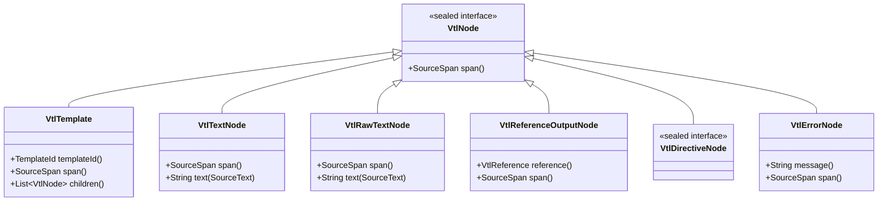

# 04 — VTL Parser and Immutable AST Design

This document details the architectural design, grammar specifications, operator precedence tables, AST hierarchy, error recovery strategies, and string interpolation handling for the **Viet Template** VTL syntax parser (`viet-template-language-vtl`).

---

## 1. Primary Objectives & Boundary Enforcement

The parser layer transforms a lexical token stream into an immutable, source-backed Abstract Syntax Tree:
```text
SourceText ──► VtlLexer ──► VtlLexResult ──► VtlParser ──► VtlParseResult ──► VtlTemplate (AST)
```

### Boundary Constraints (Syntax Only)
- **Zero Runtime Evaluation**: The parser records syntax structures. It does not evaluate expressions, inspect objects, resolve property accessors, execute methods, check truthiness, or run directives.
- **Zero Framework & Engine Dependencies**: The AST and parser reside in `viet-template-language-vtl` and depend strictly on `viet-template-api`. There is no dependency on `viet-template-runtime`, Apache Velocity, Spring, or bytecode generators.
- **Pure Immutability**: All AST nodes are Java 17 records or sealed types. All collections are immutable (`List.copyOf(...)`). No mutable parent references are maintained.

---

## 2. AST Hierarchy

Every AST node implements the sealed interface `VtlNode` and exposes a precise `SourceSpan`:



### 2.1 Directives (`VtlDirectiveNode`)
- **`VtlSetDirectiveNode`**: `(VtlAssignmentTarget target, VtlExpression value, SourceSpan span)`
- **`VtlIfDirectiveNode`**: `(List<VtlIfBranch> branches, Optional<List<VtlNode>> elseBody, SourceSpan span)`
  - `VtlIfBranch`: `(VtlExpression condition, List<VtlNode> body, SourceSpan span)`
- **`VtlForeachDirectiveNode`**: `(VtlReference loopVariable, VtlExpression iterable, List<VtlNode> body, Optional<List<VtlNode>> elseBody, SourceSpan span)`
- **`VtlIncludeDirectiveNode`**: `(List<VtlExpression> arguments, SourceSpan span)`
- **`VtlParseDirectiveNode`**: `(VtlExpression templateExpression, SourceSpan span)`
- **`VtlBreakDirectiveNode`**: `(Optional<VtlExpression> scopeExpression, SourceSpan span)`
- **`VtlStopDirectiveNode`**: `(Optional<VtlExpression> messageExpression, SourceSpan span)`
- **`VtlEvaluateDirectiveNode`**: `(VtlExpression expression, SourceSpan span)`
- **`VtlDefineDirectiveNode`**: `(VtlReference targetReference, List<VtlNode> body, SourceSpan span)`
- **`VtlMacroDefinitionNode`**: `(String name, List<VtlMacroParameter> parameters, List<VtlNode> body, SourceSpan span)`
  - `VtlMacroParameter`: `(String name, Optional<VtlExpression> defaultValue, SourceSpan span)`
- **`VtlDirectiveCallNode`**: `(String name, List<VtlExpression> arguments, SourceSpan span)`
- **`VtlBlockDirectiveCallNode`**: `(String name, List<VtlExpression> arguments, List<VtlNode> body, SourceSpan span)` (`#@panel(...) body #end`)

### 2.2 References (`VtlReference`)
- **`VtlReference`**:
  - `ReferenceNotation(boolean quiet, boolean formal)`
  - `String rootName`
  - `List<VtlAccessStep> steps`
  - `Optional<VtlExpression> alternateValue`
  - `SourceSpan span`
- **`VtlAccessStep`**:
  - `VtlPropertyAccess(String propertyName, SourceSpan span)`
  - `VtlMethodCall(String methodName, List<VtlExpression> arguments, SourceSpan span)`
  - `VtlIndexAccess(VtlExpression indexExpression, SourceSpan span)`

### 2.3 Expressions (`VtlExpression`)
Sealed hierarchy implementing `VtlExpression`:
- `VtlReferenceExpression`: Wraps a `VtlReference`.
- `VtlIntegerLiteralExpression`: Parsed integer value and raw string lexeme.
- `VtlDecimalLiteralExpression`: Parsed double value and raw string lexeme.
- `VtlBooleanLiteralExpression`: Boolean `true` or `false`.
- `VtlNullLiteralExpression`: Explicit `null`.
- `VtlStringLiteralExpression`: Single-quoted uninterpolated string literal (`'...'`).
- `VtlInterpolatedStringExpression`: Double-quoted string (`"..."`) with text and reference fragments.
- `VtlListLiteralExpression`: Elements list `[elem1, elem2, ...]`.
- `VtlMapLiteralExpression`: Map entries `{key: value, ...}`.
- `VtlRangeExpression`: Range literal `[start..end]`.
- `VtlUnaryExpression`: Operator (`!`, `not`, `-`, `+`) + operand.
- `VtlBinaryExpression`: Left expression + operator + right expression.
- `VtlGroupedExpression`: Parenthesized sub-expression `(expr)`.
- `VtlErrorExpression`: Recovery node for invalid expression syntax.

---

## 3. Operator Precedence & Pratt Binding Power

Expression parsing uses a Pratt precedence-climbing parser. Binding powers define precedence and left-associativity:

| Precedence | Operators | Associativity | Left BP | Right BP | Description |
| :--- | :--- | :--- | :--- | :--- | :--- |
| **8 (Highest)** | `.` (property), `(...)` (method call), `[...]` (index) | Left | 16 | 17 | Postfix access chains |
| **7** | Prefix `!`, `not`, `-`, `+` | Right | - | 14 | Unary operators |
| **6** | `*`, `/`, `%` | Left | 11 | 12 | Multiplicative arithmetic |
| **5** | `+`, `-` | Left | 9 | 10 | Additive arithmetic |
| **4** | `<`, `<=`, `>`, `>=`, `lt`, `le`, `gt`, `ge` | Left | 7 | 8 | Relational comparisons |
| **3** | `==`, `!=`, `eq`, `ne` | Left | 5 | 6 | Equality comparisons |
| **2** | `&&`, `and` | Left | 3 | 4 | Logical conjunction |
| **1 (Lowest)** | `\|\|`, `or` | Left | 1 | 2 | Logical disjunction |

### Associativity Rules
- All binary operators are **left-associative** ($1 - 2 - 3 \equiv (1 - 2) - 3$).
- Unary operators are **right-associative** ($!-a \equiv !(-a)$).
- Grouping parentheses `(expr)` explicitly override binding power.

---

## 4. Grammar Specifications

### 4.1 Template Structure
```ebnf
template          ::= node* EOF ;
node              ::= textNode
                    | rawTextNode
                    | referenceOutput
                    | directive
                    | errorNode ;

referenceOutput   ::= reference ;
textNode          ::= TEXT ;
rawTextNode       ::= RAW_TEXT ;
```

### 4.2 Directive Productions
```ebnf
setDirective      ::= '#set' '(' assignmentTarget '=' expression ')' ;
assignmentTarget  ::= reference ;

ifDirective       ::= ('#if' | '#{if}') '(' expression ')' block
                      (('#elseif' | '#{elseif}') '(' expression ')' block)*
                      (('#else' | '#{else}') block)?
                      ('#end' | '#{end}') ;

foreachDirective  ::= ('#foreach' | '#{foreach}') '(' reference 'in' expression ')' block
                      (('#else' | '#{else}') block)?
                      ('#end' | '#{end}') ;

includeDirective  ::= ('#include' | '#{include}') '(' expressionList ')' ;
parseDirective    ::= ('#parse' | '#{parse}') '(' expression ')' ;
breakDirective    ::= ('#break' | '#{break}') ('(' expression? ')')? ;
stopDirective     ::= ('#stop' | '#{stop}') ('(' expression? ')')? ;
evaluateDirective ::= ('#evaluate' | '#{evaluate}') '(' expression ')' ;
defineDirective   ::= ('#define' | '#{define}') '(' reference ')' block ('#end' | '#{end}') ;

macroDefinition   ::= ('#macro' | '#{macro}') '(' IDENTIFIER macroParamList? ')' block ('#end' | '#{end}') ;
macroParamList    ::= macroParam (','? macroParam)* ;
macroParam        ::= reference ('=' expression)? ;

directiveCall     ::= HASH IDENTIFIER ('(' expressionList? ')')? ;
blockMacroCall    ::= '#@' IDENTIFIER '(' expressionList? ')' block ('#end' | '#{end}') ;
```

---

## 5. String Interpolation Strategy

Double-quoted strings (`"Hello $user.name!"`) can contain interpolated references.
- An explicitly scoped interpolation scanner inspects the string contents:
  - Backslashes preceding `$` are counted: odd backslashes escape the `$` (remaining literal text); even backslashes escape each other and leave `$` active.
  - Active `$` occurrences are parsed as `VtlReference` nodes.
  - Non-reference sections are preserved as `VtlInterpolatedTextPart` nodes.
  - Every child part preserves its exact source offsets relative to the enclosing `SourceText`.
- Single-quoted strings (`'Hello $name'`) remain completely uninterpolated.

---

## 6. Error Recovery & Defensive Limits

### 6.1 Synchronization Points
When syntax errors occur, the parser records a structured `Diagnostic` and synchronizes at conservative boundaries:
- Directive beginnings (`#`)
- Block terminators (`#elseif`, `#else`, `#end`)
- Delimiters (`)`, `}`, `]`)
- Template text boundaries
- EOF

### 6.2 Defensive Nesting Limit
To prevent JVM `StackOverflowError` attacks from malicious or deeply nested inputs (e.g. 10,000 nested `#if(true)` blocks), `VtlParser` enforces a configurable `maxNestingDepth` (default: 256). Exceeding this limit immediately reports `MAX_NESTING_EXCEEDED` and unwinds safely.
