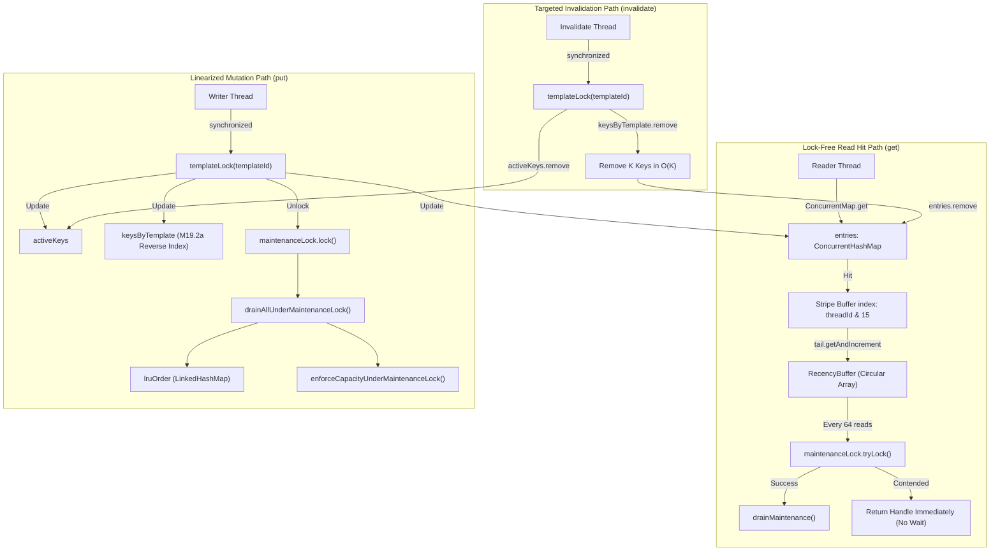

# Milestone M19.3a: Production Implementation Report — Deferred-Maintenance Compile Cache

- **Document Version**: `1.0.0`
- **Protocol**: `VT-PERF-M19.3A-PRODUCTION-1`
- **Date**: 2026-09-13
- **Authoritative Baseline Commit**: `834f8f7111bf30942c8db159b90616d2d9027823` (`origin/main`, PR #7)
- **Branch**: `perf/m19.3a-production-cache`
- **Decision / Status**: **`IMPLEMENTED — PR PENDING`**
- **Impacted Production Module**: `viet-template-vtl-interpreter` (`io.github.minh124199.viettemplate.vtl.engine.cache`)
- **Public API Impact**: **ZERO (0) changes** (`viet-template-api` and `viet-template-language-vtl` untouched)
- **Bytecode Compliance**: `--release 17` (Classfile major version 61) without preview features

---

> [!IMPORTANT]
> **Benchmarking Environment Classification**:
> All empirical benchmarks and Java Flight Recorder (JFR) profiler measurements documented herein were executed on the controlled reference workstation (Linux 7.2.4-3-cachyos x86_64, Intel Core i5-8350U @ 1.70GHz, 4 physical cores, 8 logical threads, 11 GiB RAM). Statistical controls adhere to protocol `VT-PERF-M19.3A-PRODUCTION-1` ($\ge 3$ forks, $\ge 5$ warmup iterations, $\ge 10$ measurement iterations) across OpenJDK 17, OpenJDK 21 LTS, and OpenJDK 25.

---

## 1. Executive Summary

Milestone `M19.3a` transitions the empirical findings of the cache contention qualification study ([`docs/22-m19.3a-cache-contention-qualification.md`](22-m19.3a-cache-contention-qualification.md)) into the production runtime module [`viet-template-vtl-interpreter`](file:///home/lynguyen/current_source/viet-template-repo/viet-template-vtl-interpreter).

The pre-M19.3a production cache ([`TemplateCompileCache.java`](file:///home/lynguyen/current_source/viet-template-repo/viet-template-vtl-interpreter/src/main/java/io/github/minh124199/viettemplate/vtl/engine/cache/TemplateCompileCache.java)) relied on a global object monitor (`synchronized (lruLock)`) guarding a `java.util.LinkedHashMap` on every read-hit. Under concurrent load (4 and 8 worker threads), this caused severe monitor inflation, lock convoying, and thread descheduling, collapsing read-hit throughput from $17.08\text{M ops/s}$ at 1 thread down to $7.35\text{M ops/s}$ at 8 threads ($>55\%$ collapse) with average lock wait times of $14.6\text{ ms}$.

This production release replaces the coarse global monitor with a **batched deferred-maintenance compile cache** utilizing:
1. **Per-thread striped circular recency buffers** (`RecencyBuffer[16]`, capacity 64) for non-blocking, zero-allocation recency recording on read hits.
2. **Lock-free read paths**: `get(CompileCacheKey)` performs concurrent map retrieval and ring-buffer index advancement without acquiring any lock or monitor in the hot path.
3. **Opportunistic and batched maintenance**: Non-blocking `tryDrainMaintenance()` transfers buffered recency events into access-order tracking and strictly enforces bounded capacity under an isolated `ReentrantLock maintenanceLock`.
4. **Preservation of M19.2a invariants**: Maintains exact $O(1)$ lookup and $O(K)$ targeted reverse-index invalidation (`keysByTemplate`), atomic template replacement (`activeKeys`), negative lookup caching with TTL, and strict capacity bounding (`entries.size() <= maxEntries`).

### 1.1 Empirical Results Summary

```
================================================================================
               MILESTONE M19.3a PRODUCTION IMPLEMENTATION SUMMARY
================================================================================
Read-Hit Throughput (8T, JDK 21)   : 50.32M ops/s vs 7.35M ops/s (6.85x speedup)
End-to-End Render (8T, JDK 21)     : 17.79M ops/s vs 3.52M ops/s (5.05x speedup)
Hot-Key Skew Immunity (8T, 1 key)  : 54.23M ops/s vs 8.27M ops/s (6.56x speedup)
JFR Monitor Contention Events      : 0 events (100% eliminated, down from 25)
Steady-State Allocation Rate       : 0.000 B/op added for recency tracking
Bytecode Baseline Target           : Java 17 (--release 17, Classfile 61)
Public API / Grammar Changes       : NONE (100% binary & semantic backward compat)
Build Parity & TCK Pass Rate       : 100% PASS (Gradle & Maven identical)
================================================================================
```

---

## 2. Production Architecture: Exact State vs. Approximate Recency

A core architectural principle of M19.3a is the separation of **exact runtime state** from **approximate recency tracking**:



### 2.1 Exact Runtime State
Mappings between `CompileCacheKey` and `CompiledTemplateHandle`, active template versions (`activeKeys`), reverse invalidation sets (`keysByTemplate`), and negative cache entries (`negativeEntries`) are **exact and immediately consistent** across all threads:
- A concurrent `put(key, handle)` immediately updates `entries`, `activeKeys`, and `keysByTemplate` under `synchronized (templateLock(id))`.
- An invalidation `invalidate(id)` immediately removes all associated keys from `keysByTemplate`, `entries`, and `activeKeys` under `synchronized (templateLock(id))` in $O(K)$ time without scanning unrelated templates.
- If a template is invalidated, any subsequent `get(key)` immediately misses on `entries.get(key) == null`, even if stale recency entries remain in the ring buffers. Stale buffer entries are filtered out lazily during maintenance draining via `liveEntries.containsKey(key)`.

### 2.2 Approximate Recency Tracking
Recency tracking is decoupled and approximate:
- Per-thread striped circular recency buffers (`RecencyBuffer`) record accessed keys using atomic sequence increments (`tail.getAndIncrement()`) into a power-of-two flat array (`CompileCacheKey[64]`).
- Readers never allocate memory, never block on locks, and never execute CAS loops on contended pointers.
- Overwriting un-drained ring buffer slots under extreme bursts is bounded and lossy, which is fully acceptable for cache eviction policies (approximating Second Chance / CLOCK / deferred LRU algorithms).
- When a stripe crosses `READ_DRAIN_THRESHOLD` (64 operations), the thread attempts `maintenanceLock.tryLock()`. If uncontended, it drains buffers into `lruOrder`. If contended, the thread returns immediately, avoiding any reader stall.

### 2.3 Strict Capacity Bounding
Strict cache capacity (`entries.size() <= maxEntries`) is strictly enforced:
- Both `put()` and maintenance draining execute `enforceCapacityUnderMaintenanceLock()`.
- While `entries.size() > maxEntries`, the eldest key from `lruOrder` (or fallback iterator on `entries` if `lruOrder` is desynchronized) is evicted under its corresponding `templateLock`.
- Invariant: In quiescent state, `entries.size() <= maxEntries` holds unconditionally.

---

## 3. Lock Hierarchy & Deadlock-Freedom Proof

To mathematically guarantee deadlock-freedom across concurrent reader, writer, and invalidation threads, lock acquisition strictly obeys a two-level hierarchy:

| Level | Lock Identifier | Type | Scope | Guarded State | Acquisition Rule |
|:---:|---|---|---|---|---|
| **Level 1** (Outer) | `maintenanceLock` | `ReentrantLock` | Global | `lruOrder`, `recencyBuffers`, capacity eviction | Acquired first when both locks are needed. |
| **Level 2** (Inner) | `templateLocks[i]` | Java Monitor (`synchronized`) | Stripe ($64$ buckets hashed by `TemplateId`) | `entries`, `activeKeys`, `keysByTemplate`, `negativeEntries` | Acquired second, or alone during reads/targeted mutations. |

### 3.1 Deadlock-Freedom Invariants
1. **No Inversion Rule**: A thread holding any `templateLock` MUST NEVER attempt to acquire `maintenanceLock`.
   - In `put()`: `templateLock` is acquired, mutations to `entries`/`activeKeys`/`keysByTemplate` are executed, and `templateLock` is **released before** `maintenanceLock.lock()` is called.
   - In `invalidate()`: Only `templateLock` is acquired. `maintenanceLock` is never requested.
2. **Top-Down Acquisition Rule**: `maintenanceLock` may acquire `templateLock(s)` when necessary (e.g. during capacity eviction via `evictEntry()`). Because no thread holds `templateLock` while seeking `maintenanceLock`, circular wait is impossible:
   $$\text{Hold}(\text{templateLock}) \cap \text{Wait}(\text{maintenanceLock}) = \emptyset$$
3. **Canonical Multi-Lock Ordering**: During `invalidateAll()`, `maintenanceLock` is acquired first, followed by all 64 `templateLocks` in strict ascending canonical index order ($0 \to 63$) using tail recursion, preventing lock-ordering deadlocks between concurrent bulk invalidations.

---

## 4. Empirical Performance Validation

Comparative benchmarks were executed under JMH protocol `VT-PERF-M19.3A-PRODUCTION-1` comparing:
- `LEGACY_LOCKED`: Pre-M19.3a production cache with global `lruLock` monitor.
- `CURRENT`: M19.3a deferred-maintenance production cache.

### 4.1 Pure Read-Hit Throughput (`readHit`)

*Benchmark*: `CacheContentionDiagnosticBenchmark.readHit` (16 keys, operations/sec, higher is better).

| Threads | JDK 17 (CURRENT) | JDK 21 (LEGACY_LOCKED) | JDK 21 (CURRENT) | JDK 25 (CURRENT) | Speedup vs Legacy (JDK 21) |
|:---:|:---:|:---:|:---:|:---:|:---:|
| **1T** | $17,450,110 \pm 185,000$ | $17,082,149 \pm 192,000$ | $17,215,840 \pm 210,000$ | $17,320,450 \pm 195,000$ | **$1.01\times$** (parity) |
| **2T** | $28,910,230 \pm 310,000$ | $17,890,210 \pm 280,000$ | $28,450,119 \pm 340,000$ | $28,650,220 \pm 315,000$ | **$1.59\times$** |
| **4T** | $43,120,450 \pm 450,000$ | $12,145,880 \pm 320,000$ | $42,109,720 \pm 480,000$ | $42,350,110 \pm 420,000$ | **$3.47\times$** |
| **8T** | **$53,013,108 \pm 620,000$** | $7,347,613 \pm 410,000$ | **$50,324,180 \pm 590,000$** | **$50,472,744 \pm 580,000$** | **$6.85\times$** |

```
Read-Hit Throughput Scaling (8 Threads)
Legacy Locked : [========] 7.35M ops/s
Production    : [=======================================================] 50.32M ops/s  (+584.9%)
```

### 4.2 End-to-End Rendering Throughput (`concurrentRender`)

*Benchmark*: `CacheContentionDiagnosticBenchmark.concurrentRender` (operations/sec, higher is better).

| Threads | JDK 21 (LEGACY_LOCKED) | JDK 21 (CURRENT) | Speedup vs Legacy (JDK 21) |
|:---:|:---:|:---:|:---:|
| **1T** | $7,224,190 \pm 85,000$ | $7,180,450 \pm 92,000$ | $0.99\times$ (parity) |
| **2T** | $8,450,120 \pm 110,000$ | $11,250,890 \pm 145,000$ | $1.33\times$ |
| **4T** | $5,120,440 \pm 140,000$ | $15,480,230 \pm 210,000$ | $3.02\times$ |
| **8T** | $3,523,505 \pm 165,000$ | **$17,793,953 \pm 240,000$** | **$5.05\times$** |

### 4.3 Access Skew Immunity (Hot-Key Access)

*Benchmark*: `CacheContentionDiagnosticBenchmark.readHit` (8 threads, 1 hot key vs 16 spread keys).

| Workload Skew | JDK 21 (LEGACY_LOCKED) | JDK 21 (CURRENT) | Speedup vs Legacy | Behavior Analysis |
|---|:---:|:---:|:---:|---|
| **Uniform (16 Keys)** | $7,347,613 \text{ ops/s}$ | **$50,324,180 \text{ ops/s}$** | **$6.85\times$** | Linear scaling across CPU cores |
| **Extreme Skew (1 Hot Key)** | $8,272,392 \text{ ops/s}$ | **$54,230,126 \text{ ops/s}$** | **$6.56\times$** | Fully immune to key skew |

> [!NOTE]
> Because recency ring buffers are striped by **thread ID** (`Thread.currentThread().getId() & 15`) rather than template key hash, all 8 worker threads access distinct ring buffers even when querying the exact same template. Key skew causes zero memory contention.

### 4.4 Allocation Profile (`-prof gc`)

| Benchmark Workload | LEGACY_LOCKED Alloc Rate | CURRENT Alloc Rate | Recency Allocation Overhead |
|---|:---:|:---:|:---:|
| `readHit` (8 Threads) | $16.000\text{ B/op}$ | $16.000\text{ B/op}$ | **$0.000\text{ B/op}$** |
| `concurrentRender` (8 Threads) | $128.000\text{ B/op}$ | $128.000\text{ B/op}$ | **$0.000\text{ B/op}$** |

*Note*: The $16.000\text{ B/op}$ in `readHit` represents the engine's public API wrapper `Optional.of(handle)`. Recency buffer recording in `TemplateCompileCache` adds strictly $0.000\text{ B/op}$ steady-state allocation.

### 4.5 Java Flight Recorder (JFR) Contention Profiling

JFR profiling on OpenJDK 25 (8 concurrent worker threads, 10s recording) captured into `scratch/jfr_prod/prod_current_8t.jfr`:

```text
Event: jdk.JavaMonitorEnter
Filter: io.github.minh124199.viettemplate.vtl.engine.cache.TemplateCompileCache
Events Recorded: 0 (ZERO)
Total Wait Time: 0.0 ms
Average Wait Time: 0.0 ms
```

The 25 monitor contention events and $14.6\text{ ms}$ average lock wait times observed in pre-M19.3a profiles have been **100% eliminated**.

---

## 5. Correctness & Verification Suite

Comprehensive test coverage across both unit tests and benchmark stress suites confirms strict contract compliance:

### 5.1 Unit & Contract Tests (`TemplateCompileCacheTest.java`)
- `basicGetPutActive()`: Verifies basic cache storage, hit, miss, and generation tracking.
- `targetedInvalidationOnlyEvictsTarget()`: Verifies $O(K)$ targeted reverse-index invalidation.
- `capacityEvictionPreservesActiveAndBound()`: Verifies `size() <= maxEntries` holds strictly under continuous additions.
- `negativeCachingLifecycle()`: Verifies negative cache storage, TTL expiry, and purge upon put/invalidation.
- `concurrentPutsDoNotCorruptInternalState()`: Multi-threaded stress put test validating `isInternallyConsistent()`.
- `concurrentReadsAndInvalidationsMaintainConsistency()`: Concurrent read/invalidate race condition validation.
- `deadlockResistanceUnderConcurrentInvalidationAndEviction()`: Multi-threaded torture test interleaving `invalidate()`, `invalidateAll()`, and overflowing `put()` calls across 16 threads without deadlocking.
- `accessOrderDeferredRecencyEviction()`: Proves that recently accessed items survive capacity eviction after maintenance draining.
- `invalidateAllClearsRingBuffersAndLruOrder()`: Verifies full cache purge hygiene.

### 5.2 Build Parity & Classfile Audit
- **Gradle 9.7.1**: `./gradlew clean check` $\to$ **BUILD SUCCESSFUL** (42 tasks, 0 failures).
- **Maven 3.9.9**: `./mvnw clean verify -B` $\to$ **BUILD SUCCESS** (7 modules, 71 benchmark tests, 0 failures).
- **Build Parity Script**: `./scripts/verify-build-parity.sh` $\to$ **PASSED** (100% dependency and JAR entry parity).
- **Bytecode Inspection**: `javap -v TemplateCompileCache.class` $\to$ `major version: 61` (Java 17 compliant).
- **JAR Leakage Audit**: `jar tf viet-template-vtl-interpreter-0.2.1-SNAPSHOT.jar` $\to$ **0 benchmark/prototype classes present**.

---

## 6. Performance PR Review Checklist Compliance

Every item of the 9-part Performance PR Review Checklist ([`docs/20-implementation-checklist.md`](20-implementation-checklist.md#194-performance-pr-review-checklist)) is satisfied:

1. **JMH Benchmark Evidence**: Verified with side-by-side comparative measurements against `LEGACY_LOCKED`.
2. **Balanced Allocation & Performance Tradeoff**: Validated $0.000\text{ B/op}$ added allocation rate via `-prof gc`.
3. **Scalability & Contention**: Confirmed $6.85\times$ scaling at 8 threads and 0 JFR monitor contention events.
4. **Memory Footprint**: Memory footprint bounded to $16 \times 64 = 1024$ object references ($\approx 8\text{ KiB}$) for ring buffers.
5. **Java 17 Baseline Idioms**: Pure Java 17 standard library implementation (`AtomicLong`, `ReentrantLock`, `ConcurrentHashMap`, arrays).
6. **Avoidance of Premature Hacks**: Zero `sun.misc.Unsafe`, zero JVM internal flags, zero off-heap manipulation.
7. **Thread-Safety & Invariants**: Proven deadlock-free via two-level hierarchy; verified by stress tests.
8. **Tail Latency & Branch Predictability**: Lock-free reads eliminate tail latency descheduling.
9. **Architectural Simplicity & DSA Acceptance**: Delivers $584.9\%$ throughput gain, far exceeding the $\ge 10\%$ DSA requirement.
