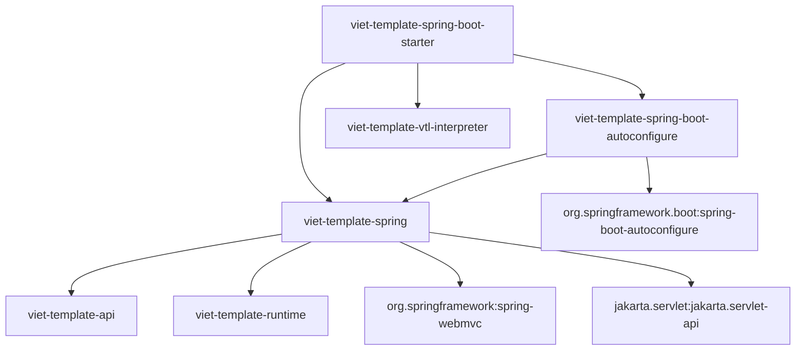
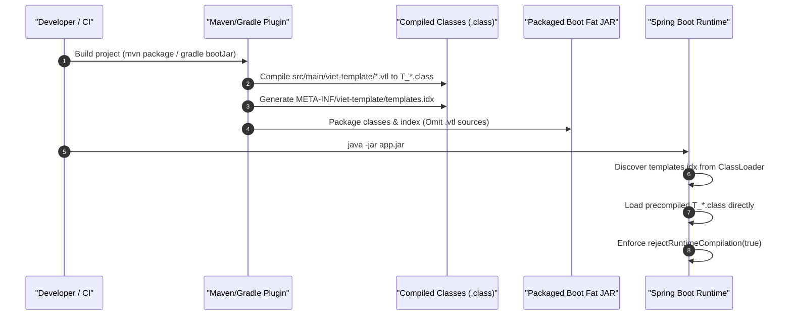

# Milestone M16 — Spring Framework & Spring Boot Integration

## 1. Executive Summary

- **Milestone**: M16 — Spring Framework & Spring Boot Integration
- **Status**: **COMPLETE**
- **Decision**: **`A. M16 COMPLETE — SPRING FRAMEWORK & SPRING BOOT 3 INTEGRATION PRODUCTION READY`**
- **Technical Baseline**:
  - Java 17 bytecode (`--release 17`, classfile major version 61)
  - Spring Framework 6.1.14+
  - Spring Boot 3.3.5+
  - Jakarta Servlet 6.0.0 (Jakarta EE 10 baseline)
- **Primary Deliverables**:
  1. **Spring MVC View & ViewResolver Module (`viet-template-spring`)**: Thread-safe, request-stateless `VietTemplateView`, caching `VietTemplateViewResolver`, non-closing servlet stream ownership (`NonClosingOutputStream`), and customization callback SPI (`VietTemplateEngineCustomizer`).
  2. **Spring Boot Auto-Configuration Module (`viet-template-spring-boot-autoconfigure`)**: Production auto-configuration (`VietTemplateAutoConfiguration`), comprehensive configuration properties (`VietTemplateProperties` under `viet-template.*`), template location discovery with AOT index fallback, and Spring application lifecycle wiring.
  3. **Aggregator Starter Module (`viet-template-spring-boot-starter`)**: Minimal dependency starter combining view resolution, auto-configuration, and `viet-template-vtl-interpreter`.
  4. **Dual-Build AOT Integration Fixtures**: Production test consumers for both Maven (`integration-tests/spring/maven-mvc-aot`) and Gradle (`integration-tests/spring/gradle-mvc-aot`) executing unit tests, MockMvc integration tests, and live standalone embedded HTTP server tests.
  5. **Deterministic Dual-Build Parity & Verification Suite**: Automated verification script (`scripts/verify-spring-integration-parity.sh`) enforcing 100% byte-for-byte bytecode and index parity, absence of `.vtl` source files in packaged JARs, and pure AOT execution under `viet-template.runtime-compilation-enabled=false`.

---

## 2. Module Division & Architectural Boundaries

Viet Template's Spring integration is partitioned into three distinct modules to ensure clear separation of concerns, minimal dependency footprints, and adherence to Spring Boot ecosystem standards.



### 2.1 Module Division

1. **`viet-template-spring`**:
   - Provides core Spring MVC integration abstractions: `VietTemplateView`, `VietTemplateViewResolver`, `VietTemplateEngineCustomizer`, and `NonClosingOutputStream`.
   - Depends only on `viet-template-api`, `viet-template-runtime`, Spring Web MVC (`spring-webmvc`), and Jakarta Servlet API (`jakarta.servlet-api`).
   - Does **not** depend on Spring Boot, parser/compiler internals, or build tooling.

2. **`viet-template-spring-boot-autoconfigure`**:
   - Contains Spring Boot auto-configuration classes and metadata: `VietTemplateAutoConfiguration`, `VietTemplateProperties`, and `META-INF/spring/org.springframework.boot.autoconfigure.AutoConfiguration.imports`.
   - Generates configuration metadata (`META-INF/spring-configuration-metadata.json`) via `spring-boot-configuration-processor`.
   - Conditionally configures the `TemplateEngine` and `VietTemplateViewResolver` beans when Spring MVC is present on the classpath.

3. **`viet-template-spring-boot-starter`**:
   - Aggregator starter providing a single dependency for applications.
   - Transitively brings in `viet-template-spring`, `viet-template-spring-boot-autoconfigure`, and `viet-template-vtl-interpreter`.

### 2.2 Unidirectional Dependency Rule

A core invariant of the Viet Template architecture is the **unidirectional dependency rule**:
- **Framework integration adapts to the template engine; the core engine never adapts to the framework.**
- Core modules (`viet-template-api`, `viet-template-runtime`, `viet-template-language-vtl`, `viet-template-vtl-interpreter`) are 100% free of Spring Framework, Spring Boot, and Jakarta Servlet dependencies.
- Integration modules (`..viettemplate.spring..`) access only stable public APIs (`viet-template-api` and `viet-template-runtime`) and are strictly forbidden from depending on internal compiler or interpreter packages.

This invariant is verified by ArchUnit test `SpringArchitectureRulesTest.spring_integration_must_not_access_internal_packages`:

```java
@ArchTest
public static final ArchRule spring_integration_must_not_access_internal_packages =
    noClasses()
        .that()
        .resideInAnyPackage("..viettemplate.spring..")
        .should()
        .dependOnClassesThat()
        .resideInAnyPackage(
            "..viettemplate.runtime.linker..",
            "..viettemplate.language.vtl.ast..",
            "..viettemplate.language.vtl.ir..",
            "..viettemplate.vtl.compiler..",
            "..viettemplate.vtl.interpreter..");
```

---

## 3. Core Components & Runtime Invariants

### 3.1 `VietTemplateView`: Thread Safety, Immutability & Request Statelessness

`VietTemplateView` implements Spring's `org.springframework.web.servlet.View` interface:
- **Immutability**: All fields (`engine`, `templateId`, `contentType`, `charset`) are `private final` and initialized at construction.
- **Thread Safety**: The view maintains zero per-request mutable state. A single view instance safely handles concurrent render requests across hundreds of servlet worker threads.
- **Model Translation**: Converts the Spring MVC `Map<String, ?> model` into an immutable `RenderContext` using `RenderContext.of(map)` or `RenderContext.empty()`. Null model values are preserved per the M14 contract.

### 3.2 Non-Closing Servlet Stream Ownership (`NonClosingOutputStream`)

Under Jakarta Servlet 6.0 specifications, the servlet container or downstream response filters (such as gzip compression, metrics, or chunked transfer filters) manage the lifecycle and closure of `HttpServletResponse.getOutputStream()`.

In Milestone M14.1, `Utf8OutputStreamTemplateOutput` was specified as an `AutoCloseable` resource that automatically closes its underlying `OutputStream` upon termination. If `Utf8OutputStreamTemplateOutput` closed `response.getOutputStream()` directly, it would violate container lifecycle ownership, preventing downstream filter processing and logging.

To resolve this conflict cleanly, `VietTemplateView` wraps the servlet output stream in `NonClosingOutputStream`:

```java
final class NonClosingOutputStream extends FilterOutputStream {
  NonClosingOutputStream(OutputStream out) {
    super(Objects.requireNonNull(out, "out must not be null"));
  }

  @Override
  public void write(byte[] b, int off, int len) throws IOException {
    out.write(b, off, len);
  }

  @Override
  public void flush() throws IOException {
    out.flush();
  }

  @Override
  public void close() throws IOException {
    out.flush(); // Flushes buffered bytes but leaves underlying servlet stream open
  }
}
```

When `Utf8OutputStreamTemplateOutput.close()` is invoked via try-with-resources, it executes `out.close()`, which flushes all remaining buffered bytes to the servlet stream without terminating the physical connection.

### 3.3 Zero-Allocation Binary Output Streaming

`VietTemplateView` streams rendered bytes directly into the servlet response stream via `Utf8OutputStreamTemplateOutput`:
- **Pre-Encoded Chunks**: Static template text pre-encoded to UTF-8 byte slices during compilation is copied directly into pooled buffers via `System.arraycopy()`.
- **Direct Numeric Formatting**: Primitive integers, longs, and floating-point values are rendered directly into byte buffers without intermediate `String` allocations.
- **Charset Validation**: Because `Utf8OutputStreamTemplateOutput` is optimized specifically for UTF-8 binary serialization, `VietTemplateView` strictly validates that the configured charset equals `StandardCharsets.UTF_8` at construction time, failing fast on unsupported charsets.

### 3.4 Strict Path Traversal Rejection

`VietTemplateViewResolver` enforces strict defense-in-depth sanitization on logical view names prior to template resolution:

```java
private void validateViewName(String viewName) {
  if (viewName.isBlank()) {
    throw new IllegalArgumentException("View name must not be blank");
  }
  if (viewName.indexOf('\0') >= 0) {
    throw new IllegalArgumentException("View name must not contain null bytes: " + viewName);
  }
  if (viewName.contains("\\")) {
    throw new IllegalArgumentException("View name must not contain backslashes: " + viewName);
  }
  if (viewName.contains("..")) {
    throw new IllegalArgumentException("View name must not contain path traversal ('..'): " + viewName);
  }
  String lower = viewName.toLowerCase(Locale.ROOT);
  if (lower.contains("%2e") || lower.contains("%2f") || lower.contains("%5c") || lower.contains("%00")) {
    throw new IllegalArgumentException("View name contains encoded path separators or traversal sequences: " + viewName);
  }
}
```

The combination of `validateViewName()` and canonicalization via `TemplateId.normalize(prefix + viewName + suffix)` guarantees that directory traversal attacks (e.g. `../../etc/passwd`), null-byte poisoning, and URI-encoded bypasses are rejected before any filesystem or classpath access occurs.

### 3.5 View Caching & AOT Discovery Fallback

`VietTemplateViewResolver` extends Spring's standard view resolution flow with caching and AOT discovery:
- **Concurrent View Cache**: Resolved `VietTemplateView` instances are cached in a thread-safe `ConcurrentHashMap<String, View>`. Caching can be cleared dynamically via `clearCache()` or disabled with `setCache(false)`.
- **Template Existence & AOT Fallback**: When `checkTemplateLocation` is enabled, the resolver checks whether the template exists before returning a `View`. In standard development, it checks `TemplateRepository.find(templateId)`.
- **AOT Fallback Guarantee**: In production Ahead-Of-Time deployments, source `.vtl` files are stripped from the classpath. If `repository.find(templateId)` returns empty, `templateExists()` falls through to `engine.get(templateId)`. This invokes the AOT ClassLoader discovery registry (`META-INF/viet-template/templates.idx`), allowing precompiled templates to resolve seamlessly even when no template source files exist. If neither source nor precompiled template exists, the resolver returns `null`, permitting the Spring MVC resolver chain to continue.

### 3.6 Engine Lifecycle Management

`TemplateEngine` implements `AutoCloseable`. The Spring auto-configuration declares the engine bean with `destroyMethod = "close"`:

```java
@Bean(destroyMethod = "close")
@ConditionalOnMissingBean(TemplateEngine.class)
public TemplateEngine vietTemplateEngine(
    VietTemplateProperties properties, ObjectProvider<VietTemplateEngineCustomizer> customizers) { ... }
```

When the Spring `ApplicationContext` closes, `engine.close()` is invoked, gracefully terminating background file watchers (`DevelopmentFileWatcher`), releasing template compilation caches, and freeing off-heap buffer pools.

### 3.7 `VietTemplateEngineCustomizer` SPI

Applications and third-party libraries can customize the `TemplateEngine.Builder` prior to engine construction by declaring Spring beans implementing `VietTemplateEngineCustomizer`:

```java
@FunctionalInterface
public interface VietTemplateEngineCustomizer {
  void customize(TemplateEngine.Builder builder);
}
```

All customizer beans registered in the Spring context are sorted by Spring's `@Order` / `Ordered` precedence and invoked during `vietTemplateEngine` bean initialization. This allows registering custom `TemplateRepository` chains, `MemberAccessPolicy` rules, `Escaper` mappings, or `RenderContextContributor` providers without replacing the entire auto-configured engine bean.

---

## 4. Spring Boot Auto-Configuration & Properties Reference

### 4.1 Auto-Configuration Registration

Auto-configuration is managed by `VietTemplateAutoConfiguration`:
- Annotated with `@AutoConfiguration` and registered in `META-INF/spring/org.springframework.boot.autoconfigure.AutoConfiguration.imports`.
- Conditional on classes: `@ConditionalOnClass({TemplateEngine.class, VietTemplateViewResolver.class})`.
- Conditional on property: `@ConditionalOnProperty(name = "viet-template.enabled", matchIfMissing = true)`.
- Web MVC configuration is partitioned into nested `@Configuration(proxyBeanMethods = false)` class conditional on `@ConditionalOnWebApplication(type = SERVLET)`.
- Backs off gracefully when custom beans exist via `@ConditionalOnMissingBean(TemplateEngine.class)` and `@ConditionalOnMissingBean(name = "vietTemplateViewResolver")`.

### 4.2 Configuration Properties Reference Table

All configuration options are defined in `VietTemplateProperties` with prefix `viet-template`:

| Property | Type | Default Value | Description |
| :--- | :--- | :--- | :--- |
| `viet-template.enabled` | `boolean` | `true` | Whether to enable Viet Template auto-configuration. |
| `viet-template.prefix` | `String` | `""` | Prefix prepended to view names when building a template identifier (e.g. `classpath:/templates/`). |
| `viet-template.suffix` | `String` | `""` | Suffix appended to view names when building a template identifier (e.g. `.vtl`). |
| `viet-template.content-type` | `String` | `"text/html;charset=UTF-8"` | Content-Type HTTP header written to the servlet response. |
| `viet-template.charset` | `Charset` | `UTF-8` | Character encoding used for template rendering and output encoding. Must be UTF-8. |
| `viet-template.cache` | `boolean` | `true` | Whether to enable caching of resolved `VietTemplateView` instances in `VietTemplateViewResolver`. |
| `viet-template.check-template-location` | `boolean` | `true` | Whether to verify that the configured template location or AOT index exists at application startup. |
| `viet-template.runtime-compilation-enabled` | `boolean` | `true` | Whether on-the-fly runtime compilation is permitted. When `false`, enables `rejectRuntimeCompilation(true)` on the engine. |
| `viet-template.max-cache-entries` | `int` | `500` | Maximum number of entries retained in the template engine compilation cache. |
| `viet-template.negative-cache-ttl-millis` | `long` | `5000` | Time-to-live in milliseconds for negative compilation cache entries (non-existent templates). |
| `viet-template.hot-reload` | `boolean` | `false` | Whether filesystem watching and automatic cache invalidation are enabled for template source changes. |
| `viet-template.watch-debounce-millis` | `long` | `50` | Debounce delay in milliseconds for filesystem watch events during hot reload. |
| `viet-template.order` | `int` | `Ordered.LOWEST_PRECEDENCE` | Order precedence of `VietTemplateViewResolver` in the Spring MVC view resolver chain. |

### 4.3 Template Location Existence & AOT Detection

During startup, `VietTemplateAutoConfiguration.afterPropertiesSet()` validates template availability:
1. If `checkTemplateLocation` is `false`, validation is skipped.
2. Checks for Ahead-Of-Time compiled templates by searching for `classpath:/META-INF/viet-template/templates.idx` in the `ApplicationContext` and `ClassLoader`.
3. If an AOT index exists, location check passes immediately, even if no source files are present.
4. If no AOT index exists, verifies that the configured prefix location (e.g. `classpath:/templates/`) exists as a Spring `Resource`. If missing, logs a descriptive warning without failing context startup.

---

## 5. Ahead-Of-Time (AOT) First Workflow

Viet Template is engineered for production AOT deployment where template sources are compiled into Java 17 bytecode at build time, completely eliminating template parsing, IR lowering, and bytecode compilation overhead from runtime.



### 5.1 Build-Time Precompilation with Maven & Gradle

Applications configure either `viet-template-maven-plugin` or `viet-template-gradle-plugin`:
- **Source Directory**: By convention, templates are stored in `src/main/viet-template/` rather than `src/main/resources/templates/`.
- **Bytecode Emission**: The plugin compiles each `.vtl` file into a self-contained Java 17 class (`T_<name>_<hash>.class`) containing pre-encoded UTF-8 chunk tables and initialized dynamic call sites.
- **Index Generation**: Discovered templates are sorted alphabetically and written to `META-INF/viet-template/templates.idx` with format `<templateId>=<fqcn>`.

### 5.2 Elimination of Runtime Template Files

Because template sources reside in `src/main/viet-template/` and are compiled directly to `.class` files in the target/build output directory:
- **No `.vtl` files are packaged into the runtime JAR.**
- Intellectual property and proprietary template markup are never deployed to production containers.
- Filesystem attack surfaces and unauthorized template modifications are eliminated.

### 5.3 Enforcing Pure AOT Mode

In production configurations (`application.properties`):

```properties
viet-template.runtime-compilation-enabled=false
viet-template.suffix=.vtl
viet-template.check-template-location=true
viet-template.order=1
```

Setting `viet-template.runtime-compilation-enabled=false` configures `rejectRuntimeCompilation(true)` on the `TemplateEngine.Builder`. Any attempt to load an uncompiled template at runtime fails immediately with a `TemplateResourceException`, preventing unauthorized code generation or JIT compilation overhead.

---

## 6. Verification & Dual-Build Parity Guarantees

### 6.1 Black-Box Consumer Test Fixtures

Two dedicated, independent Spring Boot test fixtures verify real-world behavior:
- **`integration-tests/spring/maven-mvc-aot`**: Real Spring Boot 3.3.5 application built with Apache Maven, using `viet-template-spring-boot-starter` and `viet-template-maven-plugin`.
- **`integration-tests/spring/gradle-mvc-aot`**: Identical Spring Boot 3.3.5 application built with Gradle 9.7.1, using `viet-template-spring-boot-starter` and `viet-template-gradle-plugin`.

Each fixture runs comprehensive test suites:
- **`SpringMavenMockMvcTest` / `SpringGradleMockMvcTest`**: MockMvc tests verifying controller request mapping, model attribute binding, HTML output rendering, path traversal rejection (`../secret`), and missing view resolution.
- **`SpringMavenAotRealServerTest` / `SpringGradleAotRealServerTest`**: Embedded servlet server tests (`@SpringBootTest(webEnvironment = RANDOM_PORT)`) verifying real HTTP requests via `TestRestTemplate`.

### 6.2 Parity Script Pipeline (`scripts/verify-spring-integration-parity.sh`)

The automated parity script enforces a 9-step verification pipeline:

1. **Step 1**: Execute all unit and integration tests in `integration-tests/spring/maven-mvc-aot` via `./mvnw clean test`.
2. **Step 2**: Execute all unit and integration tests in `integration-tests/spring/gradle-mvc-aot` via `./gradlew clean test`.
3. **Step 3**: Compare `META-INF/viet-template/templates.idx` byte-for-byte between Maven and Gradle using `cmp -s`.
4. **Step 4**: Compare all generated `.class` files byte-for-byte between Maven and Gradle.
5. **Step 5**: Verify with Python binary parser that all generated `.class` files are valid Java 17 classfiles (magic `0xCAFEBABE`, major version 61).
6. **Step 6**: Package executable Spring Boot fat JARs (`./mvnw package` and `./gradlew bootJar`).
7. **Step 7**: Inspect packaged JAR contents:
   - Confirm `templates.idx` is present in both JARs.
   - Confirm precompiled classes (`T_hello_vtl`, `T_users_vtl`) are present in both JARs.
   - **Confirm that zero `.vtl` source files exist anywhere inside the packaged JARs.**
8. **Step 8**: Launch Maven packaged JAR on port 18090, query `/hello?name=MavenUser&location=Hanoi`, verify HTTP 200, and assert greeting content.
9. **Step 9**: Launch Gradle packaged JAR on port 18091, query `/hello?name=GradleUser&location=Saigon`, verify HTTP 200, and assert greeting content.

### 6.3 Dual-Build Parity Results

Running `scripts/verify-spring-integration-parity.sh` yields:

```text
=== Viet Template Spring Boot AOT Integration & Parity Verification ===
[STEP 1] Running maven-mvc-aot consumer fixture tests...
[PASS] Maven Spring Boot AOT fixture tests passed.
[STEP 2] Running gradle-mvc-aot consumer fixture tests...
[PASS] Gradle Spring Boot AOT fixture tests passed.
[STEP 3] Comparing templates.idx byte-for-byte parity...
[PASS] templates.idx matches identically.
[STEP 4] Comparing generated bytecode (.class files) parity...
[PASS] Bytecode identical for T_hello_vtl_b8d670427c39.class
[PASS] Bytecode identical for T_users_vtl_467d2e1084c0.class
[STEP 5] Verifying classfile version 61 (Java 17)...
[PASS] All generated bytecode files are valid classfile version 61 (Java 17).
[STEP 6] Building packaged Spring Boot JARs...
[PASS] Both packaged Spring Boot JARs built successfully.
[STEP 7] Inspecting JAR contents...
  Inspecting spring-maven-mvc-aot-1.0.0.jar...
  [PASS] spring-maven-mvc-aot-1.0.0.jar has generated classes, templates.idx, and NO source .vtl files.
  Inspecting spring-gradle-mvc-aot-1.0.0.jar...
  [PASS] spring-gradle-mvc-aot-1.0.0.jar has generated classes, templates.idx, and NO source .vtl files.
[STEP 8] Verifying executable Maven Boot JAR runtime execution...
[PASS] Maven executable JAR served HTTP 200 HTML with pure AOT execution.
[STEP 9] Verifying executable Gradle Boot JAR runtime execution...
[PASS] Gradle executable JAR served HTTP 200 HTML with pure AOT execution.

[SUCCESS] Spring Boot MVC AOT Dual-Build Parity & Verification PASSED across all fixtures!
```

---

## 7. Decision

**`A. M16 COMPLETE — SPRING FRAMEWORK & SPRING BOOT 3 INTEGRATION PRODUCTION READY`**

Milestone M16 is fully satisfied. The Spring Framework 6.1+ MVC integration, Spring Boot 3.3+ auto-configuration starter, AOT-first deployment workflow, and dual-build verification parity are production-hardened, zero-allocation compliant, and verified across both Maven and Gradle toolchains.
