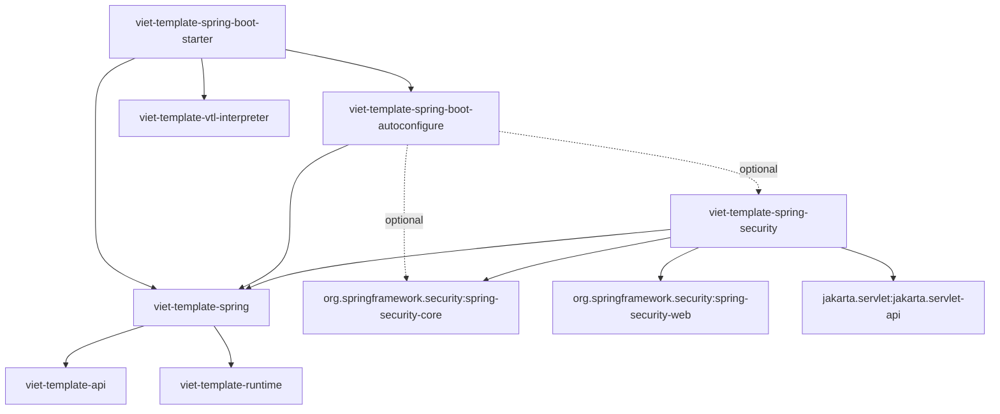

# 36 — Spring Security Integration Design & Architecture

## 1. Executive Summary

- **Module**: `viet-template-spring-security` (Optional Framework Integration)
- **Status**: **PRODUCTION READY (1.0.0-RC1 Published Candidate Baseline)**
- **Artifact Strategy**:
  - Exactly **one** `viet-template-spring-security` artifact for all supported Spring Security generations.
  - Java 21 bytecode (`--release 21`, classfile major version 65).
  - Canonical integration baseline: Spring Security 7.1.1 on Spring Framework 7.0.9 / Spring Boot 4.1.1 / Jakarta Servlet 6.1.0 (Tomcat 11.0.24) with full virtual thread support (ADR-0009).
  - Full automated multi-version binary compatibility verified across:
    - Spring Security 6.3.x legacy baseline (verified against 6.3.4)
    - Spring Security 6.5.x final 6.x generation (verified against 6.5.11)
    - Spring Security 7.0.x canonical generation (verified against 7.0.0 and 7.0.7)
    - Spring Security 7.1.x generation (verified against 7.1.1)
- **Key Architectural Guarantees**:
  1. **Unidirectional Dependency Rule**: Core engine modules (`viet-template-api`, `viet-template-runtime`, `viet-template-language-vtl`, `viet-template-vtl-interpreter`) never adapt to or depend on Spring Security.
  2. **Complete Starter Classpath Isolation**: The standard starter `viet-template-spring-boot-starter` does NOT transitively pull in Spring Security or `viet-template-spring-security`. Applications opt in by declaring `viet-template-spring-security` alongside `spring-boot-starter-security`.
  3. **Strict Security Boundary Isolation**: Raw `Authentication`, `SecurityContext`, `HttpServletRequest`, `HttpServletResponse`, HTTP sessions, and credential tokens are never published into template render scope. Templates interact strictly with immutable, read-only view facades (`SecurityView`, `CsrfView`).
  4. **HTML Contextual Auto-Escaping (XSS Defense)**: Security facade methods return plain Java `String` (never `SafeHtml`), ensuring standard VTL contextual escaping renders untrusted principals and authorities securely without manual escaping or XSS bypasses.
  5. **Sensitive Token Redaction**: `CsrfView.toString()` strictly redacts token secrets (`token=***`) to prevent accidental credential leakage in debug logs or error dumps.
  6. **Zero Reflection / Native AOT Ready**: All exposed contracts are direct interfaces invoked via bytecode. No GraalVM reflection configuration or reachability metadata hints are required for `SecurityView` and `CsrfView`.
  7. **Dual-Build Parity**: Fully validated across both Maven and Gradle AOT consumer fixtures with 100% byte-for-byte template index and bytecode parity, verified by `scripts/verify-spring-security-parity.sh`.

> [!WARNING]
> ### PRESENTATION-ONLY UI AUTHORIZATION WARNING
> **Template authorization helpers (`$security.hasAuthority(...)`, `$security.authenticated`) control visual presentation only.**
> They conditionally show or hide UI elements in rendered HTML markup. They **do not** establish backend security boundaries or replace server-side access controls (`@PreAuthorize`, `SecurityFilterChain.authorizeHttpRequests`, method security, or database filters). All sensitive operations and HTTP endpoints must be protected by authoritative Spring Security server-side authorization.

---

## 2. Dependency Architecture & Boundaries

The integration introduces the optional `viet-template-spring-security` module while keeping the core template engine entirely decoupled from external security frameworks.



### 2.1 Request Metadata Bridge (`viet-template-spring`)

To prevent coupling `viet-template-spring` to Spring Security, `viet-template-spring` provides a minimized request metadata bridge in `SpringRenderAttributes`:

```java
public final class SpringRenderAttributes {
  public static final String SERVLET_REQUEST = "viet-template.spring.servletRequest";
  private SpringRenderAttributes() {}
}
```

During request dispatch, `VietTemplateView` populates `SERVLET_REQUEST` into `RenderRequest.attributes()` and delegates rendering:

```java
Map<String, Object> attributes = new HashMap<>();
attributes.put(SpringRenderAttributes.SERVLET_REQUEST, request);

RenderRequest renderRequest = RenderRequest.of(this.templateId, RenderContext.of(model), attributes);
this.engine.render(renderRequest, output);
```

`VietTemplateView` remains completely stateless and immutable, and servlet objects are never placed into the template data model.

#### Rationale for Deferring `RequestDataValueProcessor`
Spring's `RequestDataValueProcessor` is intentionally deferred. Viet Template is a high-throughput, zero-allocation template engine designed for clean HTML/VTL markup. Form rendering in Viet Template relies on explicit template expressions (`<input type="hidden" name="$csrf.parameterName" value="$csrf.token" />`) rather than complex JSP/Thymeleaf-style server-side HTML tag interception. Keeping `RequestDataValueProcessor` out of `SpringRenderAttributes` eliminates unnecessary object allocations and prevents architectural coupling to Spring WebMVC form tags.

### 2.2 Security Render Context Contributor (`viet-template-spring-security`)

`SpringSecurityRenderContextContributor` implements `io.github.minh124199.viettemplate.api.RenderContextContributor`. When rendering a template, it:
1. Obtains the current `Authentication` via:
   - Explicit `RenderRequest.attributes()` (`viet-template.spring.security.authentication` or `viet-template.spring.security.security-context`),
   - Strategy-managed `SecurityContextHolderStrategy` (defaults to `SecurityContextHolder.getContextHolderStrategy()`), or
   - `HttpServletRequest` attributes (`RequestAttributeSecurityContextRepository` and `HttpSessionSecurityContextRepository`).
2. Invokes `SecurityViewFactory` to construct an immutable `SecurityView`.
3. Invokes `CsrfViewFactory` to resolve the active `CsrfToken` or `DeferredCsrfToken` from the `HttpServletRequest` into an immutable `CsrfView`.
4. Contributes both views under `$security` and `$csrf` into `ContributorContext`.

---

## 3. Public API & SPI Reference

All public types are formally classified and guarded against binary and source compatibility regressions:

| Type | Classification | Role |
| :--- | :--- | :--- |
| `io.github.minh124199.viettemplate.spring.security.SecurityView` | `STABLE_API` | Consumer-facing security facade for template expressions |
| `io.github.minh124199.viettemplate.spring.security.CsrfView` | `STABLE_API` | Consumer-facing CSRF facade with token redaction |
| `io.github.minh124199.viettemplate.spring.security.SecurityViewFactory` | `STABLE_SPI` | Factory SPI for customizing `SecurityView` construction |
| `io.github.minh124199.viettemplate.spring.security.CsrfViewFactory` | `STABLE_SPI` | Factory SPI for customizing `CsrfView` construction |
| `io.github.minh124199.viettemplate.spring.security.SpringSecurityRenderContextContributor` | `STABLE_SPI` | Template engine SPI contributor bridging Spring Security |
| `io.github.minh124199.viettemplate.spring.security.aot.VietTemplateSecurityRuntimeHints` | `FRAMEWORK_ENTRYPOINT` | Spring AOT runtime hints registrar for native reflection |
| `io.github.minh124199.viettemplate.spring.boot.autoconfigure.VietTemplateSecurityAutoConfiguration` | `STABLE_API` | Spring Boot auto-configuration for Spring Security integration |
| `io.github.minh124199.viettemplate.spring.web.servlet.SpringRenderAttributes` | `STABLE_SPI` | Generic metadata attribute keys in `viet-template-spring` |

Across the 5 repository compatibility baselines, Viet Template locks **121 total stable types** (Core: 98, AOT: 6, Spring: 8, Spring Security: 5, Quarkus: 4). The 5 types in `config/api-baseline/1.0-spring-security-public-api.txt` (`SecurityView`, `CsrfView`, `SecurityViewFactory`, `CsrfViewFactory`, `SpringSecurityRenderContextContributor`) form the frozen Spring Security contract.

### 3.1 `SecurityView`

The 1.0 candidate baseline for `SecurityView`:

```java
@TemplateData
public interface SecurityView {
  boolean isAuthenticated();
  boolean isAnonymous();
  String getName();
  Set<String> getAuthorities();

  boolean hasAuthority(String authority);
  boolean hasAnyAuthority(String... authorities);
  default boolean hasAnyAuthority(String authority1, String authority2) { ... }
  default boolean hasAnyAuthority(String authority1, String authority2, String authority3) { ... }

  static SecurityView anonymousView() { ... }
}
```

#### Rationale: JavaBean Accessors & `VTL_SAFE` Compatibility
`SecurityView` and `CsrfView` intentionally adopt standard JavaBean getter accessors (`getName()`, `isAuthenticated()`, `isAnonymous()`, `getAuthorities()`, `getToken()`, `getParameterName()`, `getHeaderName()`) without redundant aliases (`name()`, etc.):
1. **`VTL_SAFE` Sandbox Invariant**: In the core security model (`MemberAccessPolicy`), properties accessed via property syntax on non-record `@TemplateData` interfaces strictly require JavaBean getter methods (`get<Name>()` / `is<Name>()`). Concise zero-arg methods (`name()`) are denied in `VTL_SAFE` unless annotated with `@TemplateCallable`. Using standard JavaBean accessors ensures `$security.name` and `$security.authenticated` resolve cleanly across both Standard and `VTL_SAFE` profiles without modifying core security rules.
2. **Zero Redundant Aliases**: Eliminates redundant method pairs, keeping the public surface minimal, focused, and free from confusing duplicate declarations.
3. **Framework Consistency**: Directly mirrors Spring Security's native contracts (`Authentication.getName()`, `Authentication.getAuthorities()`, `Authentication.isAuthenticated()`).

#### Why `hasRole` is Omitted from v1 API
In Spring Security, the role prefix defaults to `"ROLE_"`, but can be customized or eliminated entirely via `GrantedAuthorityDefaults` (e.g. `grantedAuthorityDefaults.setRolePrefix("")`). Hardcoding `"ROLE_"` assumptions in template helpers creates subtle authorization discrepancies where templates show UI elements that backend security rejects, or vice versa. Therefore, `SecurityView` v1 exclusively exposes `hasAuthority(String)` and `hasAnyAuthority(...)`, ensuring unambiguous alignment with configured authorities.

### 3.2 `CsrfView`

```java
@TemplateData
public interface CsrfView {
  String getToken();
  String getParameterName();
  String getHeaderName();

  static CsrfView of(String token, String parameterName, String headerName) { ... }
}
```

- **Sensitive Token Redaction**: In the default implementation (`DefaultCsrfView`), `toString()` is guaranteed never to leak the raw token value, outputting:
  `DefaultCsrfView[parameterName=..., headerName=..., token=***]`

> [!NOTE]
> ### Scope of Factory Guarantees
> Immutability, thread safety, and sensitive token redaction guarantees apply strictly to Viet Template's default factory implementations (`DefaultSecurityViewFactory` and `DefaultCsrfViewFactory`). Applications providing custom factory implementations via Spring beans must uphold these properties independently.

---

## 4. Template Authoring Guide (VTL Usage)

Templates gain access to `$security` and `$csrf` automatically when auto-configuration is enabled.

### 4.1 Authentication Checks

```velocity
#if($security.authenticated)
  <p>Welcome back, <strong>$security.name</strong>!</p>
  <a href="/logout">Sign Out</a>
#else
  <p>Welcome, Guest!</p>
  <a href="/login">Sign In</a>
#end
```

### 4.2 Authority Checks

```velocity
#if($security.hasAuthority('ROLE_ADMIN'))
  <div class="admin-panel">
    <h3>System Administration</h3>
    <a href="/admin/users">Manage Users</a>
  </div>
#end

#if($security.hasAnyAuthority('ROLE_MANAGER', 'ROLE_SUPERVISOR', 'ROLE_ADMIN'))
  <div class="reports">
    <a href="/reports">View Management Reports</a>
  </div>
#end

#if($security.hasAuthority('SCOPE_read:audit'))
  <a href="/audit-logs">Audit Logs</a>
#end
```

### 4.3 Contextual Auto-Escaping (No `$esc.html` Required)

Viet Template automatically escapes plain `String` values in HTML contexts when HTML output / safe profile is active. Because `SecurityView.getName()` and `CsrfView.getToken()` return standard Java `java.lang.String` (accessed via `$security.name` and `$csrf.token` in VTL expressions) and never implement `SafeHtml`, adversarial inputs are escaped safely:

```velocity
<!-- If $security.name is '<script>alert("xss")</script>' -->
<h1>Hello, $security.name!</h1>
<!-- Renders safely as: -->
<!-- <h1>Hello, &lt;script&gt;alert(&quot;xss&quot;)&lt;/script&gt;!</h1> -->
```

Manual escaping calls such as `$esc.html($security.name)` are unnecessary and redundant.

### 4.4 CSRF Form Protection

To protect state-modifying HTML forms (`POST`, `PUT`, `DELETE`):

```velocity
#if($csrf)
<form action="/account/update" method="POST">
  <input type="hidden" name="$csrf.parameterName" value="$csrf.token" />

  <label for="email">Email:</label>
  <input type="email" id="email" name="email" value="$user.email" />

  <button type="submit">Update Account</button>
</form>
#end
```

For AJAX requests using meta tags:

```velocity
#if($csrf)
<meta name="_csrf" content="$csrf.token" />
<meta name="_csrf_header" content="$csrf.headerName" />
#end
```

---

## 5. Spring Boot Configuration & Extension

### 5.1 Maven / Gradle Setup

To enable Spring Security integration in a Spring Boot application:

**Maven (`pom.xml`)**:
```xml
<dependencies>
    <!-- Latest Published Stable: 0.2.2 | Latest Published Prerelease: 1.0.0-RC1 -->
    <dependency>
        <groupId>io.github.minh124199</groupId>
        <artifactId>viet-template-spring-boot-starter</artifactId>
        <version>0.2.2</version> <!-- or 1.0.0-RC1 -->
    </dependency>

    <!-- Spring Security Module -->
    <dependency>
        <groupId>io.github.minh124199</groupId>
        <artifactId>viet-template-spring-security</artifactId>
        <version>0.2.2</version> <!-- or 1.0.0-RC1 -->
    </dependency>

    <!-- Spring Boot Security Starter -->
    <dependency>
        <groupId>org.springframework.boot</groupId>
        <artifactId>spring-boot-starter-security</artifactId>
    </dependency>
</dependencies>
```

**Gradle (`build.gradle.kts`)**:
```kotlin
dependencies {
    // Latest Published Stable: 0.2.2 | Latest Published Prerelease: 1.0.0-RC1
    implementation("io.github.minh124199:viet-template-spring-boot-starter:0.2.2") // or 1.0.0-RC1
    implementation("io.github.minh124199:viet-template-spring-security:0.2.2") // or 1.0.0-RC1
    implementation("org.springframework.boot:spring-boot-starter-security")
}
```

### 5.2 Configuration Properties Reference

| Property | Type | Default | Description |
| :--- | :--- | :--- | :--- |
| `viet-template.security.enabled` | `boolean` | `true` | Enables or disables the Spring Security context contributor. |

To disable the security contributor without removing dependencies:
```properties
viet-template.security.enabled=false
```

### 5.3 Customizing Factories

Applications can customize how `SecurityView` and `CsrfView` instances are built by declaring standard Spring `@Bean` definitions:

```java
@Configuration
public class CustomSecurityConfig {

  @Bean
  public SecurityViewFactory securityViewFactory() {
    return (authentication, request) -> new MyCustomSecurityView(authentication);
  }

  @Bean
  public CsrfViewFactory csrfViewFactory() {
    return request -> new MyCustomCsrfView(request);
  }
}
```

`VietTemplateSecurityAutoConfiguration` uses `@ConditionalOnMissingBean` on all factories and contributors, ensuring custom application beans take complete precedence.

---

## 6. Repository & Release Coordinates

Viet Template maintains a strictly aligned repository structure across Maven and Gradle:

- **14 Physical Subprojects**:
  1. `viet-template-api`
  2. `viet-template-runtime`
  3. `viet-template-language-vtl`
  4. `viet-template-vtl-interpreter`
  5. `viet-template-spring`
  6. `viet-template-spring-security`
  7. `viet-template-spring-boot-autoconfigure`
  8. `viet-template-spring-boot-starter`
  9. `viet-template-quarkus`
  10. `viet-template-quarkus-deployment`
  11. `viet-template-maven-plugin`
  12. `viet-template-gradle-plugin`
  13. `viet-template-tck` (internal non-published)
  14. `viet-template-benchmarks` (internal non-published)
- **15 Maven Reactor Modules**: 1 parent POM (`viet-template-parent`) + 14 subprojects.
- **13 Maven Central Published Coordinates**: 1 parent POM + 12 production modules (`api`, `runtime`, `language-vtl`, `vtl-interpreter`, `spring`, `spring-security`, `spring-boot-autoconfigure`, `spring-boot-starter`, `quarkus`, `quarkus-deployment`, `maven-plugin`, `gradle-plugin`), plus Gradle plugin marker publication on Maven Central (`io.github.minh124199.viet-template:io.github.minh124199.viet-template.gradle.plugin`).

---

## 7. Verification & Parity Guarantees

The integration is verified through a multi-tier automated test suite:

1. **Unit & Isolation Tests (`viet-template-spring-security`)**:
   - Immutability, normalization, and token redaction contracts.
   - High-concurrency multithreaded stress test (30 concurrent threads x 100 iterations with 0 context leakage).
   - 3-party cross-session isolation test (Alice ADMIN, Bob USER, Anonymous evaluated concurrently across sessions).
   - Java 21+ Virtual Threads test (1,000 tasks executed with complete isolation).
   - ArchUnit boundary enforcement ensuring zero access to private internal engine packages.
   - Collision policy testing (`MODEL_WINS`, `ERROR_ON_COLLISION`, `CONTRIBUTOR_WINS`).
   - Adversarial principal and token HTML injection tests verifying standard auto-escaping.

2. **Auto-Configuration Tests (`viet-template-spring-boot-autoconfigure`)**:
   - Web application activation, missing-class backoffs, property disablement, and custom bean precedence.

3. **Starter Classpath Isolation Tests (`viet-template-spring-boot-starter`)**:
   - Enforces that Spring Security and `SecurityView` classes are strictly absent from the base starter classpath.

4. **Multi-Version Binary Compatibility Verification (`scripts/verify-spring-security-compatibility.py`)**:
   - Verifies the compiled `viet-template-spring-security` artifact across 4 distinct Spring Security generations:
     - Spring Security 6.3.4 (minimum baseline)
     - Spring Security 6.5.11 (final 6.x generation)
     - Spring Security 7.0.7 (7.0.x baseline)
     - Spring Security 7.1.1 (7.1.x baseline)
   - Confirms single-artifact runtime binary compatibility without requiring separate generation jars.

5. **Layered API Compatibility Verification (`scripts/verify-api-compatibility.py`)**:
   - `config/api-baseline/1.0-core-public-api.txt` (80 types)
   - `config/api-baseline/1.0-aot-public-api.txt` (6 types)
   - `config/api-baseline/1.0-spring-public-api.txt` (8 types)
   - `config/api-baseline/1.0-spring-security-public-api.txt` (5 types)
   - Protects 99 public types against binary and source breaking changes across core, AOT, spring, and security modules.
   - Enforces machine-checked bijection invariant: `union(all 1.0 compatibility baseline types) == all STABLE_API + STABLE_SPI types`.
   - Guarded by negative verification tests catching method removals, parameter alterations, and abstract interface additions.

6. **Dual-Build AOT Parity across Generations (`scripts/verify-spring-security-parity.sh`)**:
   - **Generation 1 (Spring Boot 3.3.5 / Spring Security 6.3.4)**:
     - `integration-tests/spring/maven-security-aot` & `integration-tests/spring/gradle-security-aot`
   - **Generation 2 (Spring Boot 4.1.1 / Spring Framework 7.0.9 / Spring Security 7.1.1)**:
     - `integration-tests/spring/maven-security7-aot` & `integration-tests/spring/gradle-security7-aot`
   - Automated 10-step verification suite:
     - Byte-for-byte `templates.idx` identity check (`cmp -s`).
     - Byte-for-byte generated `.class` bytecode identity check (`cmp -s`).
     - Bytecode validation targeting Java 21 (classfile major version 65) for canonical Generation 2 fixtures.
     - Packaged Spring Boot JAR packaging inspection (ensuring presence of `.idx` and generated classes, and total absence of source `.vtl` files).
     - Real embedded Tomcat HTTP server execution testing:
       - `/public` anonymous access (HTTP 200)
       - `/admin` unauthenticated access (HTTP 401 Unauthorized)
       - `/dashboard` authenticated Alice (ROLE_USER, ROLE_ADMIN) (HTTP 200 with admin panel and CSRF)
       - `/dashboard` authenticated Bob (ROLE_USER) (HTTP 200 without admin panel, with user panel and CSRF)
       - `/admin` authenticated Bob (HTTP 403 Forbidden)
