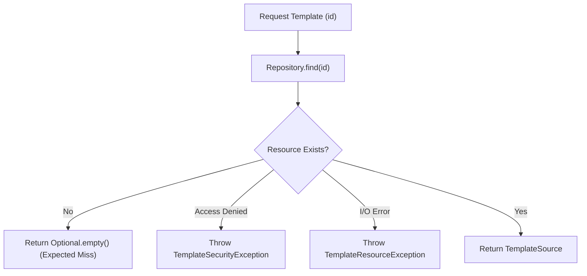
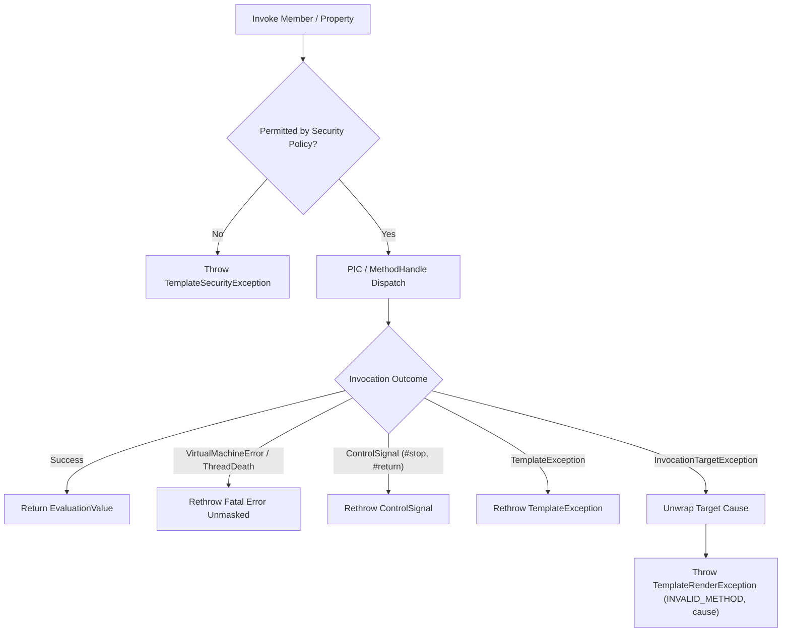
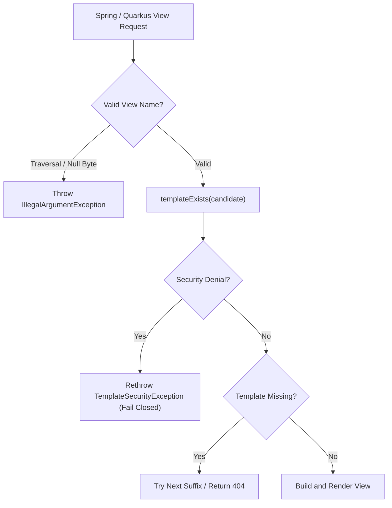

# Runtime Exception Semantics and Failure Boundaries

## 1. Overview and Governing Principles

Viet Template enforces a deterministic, boundary-safe runtime exception model. The architecture is governed by five non-negotiable principles:

1. **Catch Only What Is Understood**: Never use broad `catch (Exception)` or `catch (Throwable)` unless the catch block forms an intentional, fully-audited system boundary.
2. **Never Swallow Fatal JVM Errors**: `VirtualMachineError` (including `OutOfMemoryError` and `StackOverflowError`) and `ThreadDeath` must escape unmasked across all execution tiers, reflection bridges, dynamic linkers, and framework adapters.
3. **Security Fails Closed**: `TemplateSecurityException` must propagate immediately to caller boundaries. Security denials must never be interpreted as template absence, converted into fallback existence checks, or swallowed to return empty or anonymous states.
4. **Distinguish Expected Misses from System Failures**: Missing template resources return `Optional.empty()` without allocating exception stack traces. I/O failures, corrupted files, and access denials throw dedicated domain exceptions (`TemplateResourceException`, `TemplateSecurityException`).
5. **Preserve Root Causes and Context**: Reflection invocations must unwrap `InvocationTargetException` to expose the underlying application cause, maintaining `TemplateId`, `SourceSpan`, and diagnostic codes.

---

## 2. Canonical Failure Classifications

Every failure condition across the repository is classified into one of 16 canonical categories:

| Category | Description | Representative Exception / Code |
|---|---|---|
| `EXPECTED_MISS` | Normal, non-exceptional absence of a template or optional property | `Optional.empty()`, `EvaluationValue.undefined()` |
| `OPTIONAL_CAPABILITY_PROBE` | Probing optional integration (e.g. Quarkus Security, Arc CDI) | Checked class lookup, safe fallback |
| `USER_INPUT_ERROR` | Malformed parameters, invalid encoding name, null arguments | `IllegalArgumentException` |
| `RESOLUTION` | Failure locating or reading template source bytes | `TemplateResourceException` (`VTLR01`) |
| `PARSE` | Syntax error during tokenization or parsing | `TemplateSyntaxException` (`SYNTAX:PARSE_ERROR`) |
| `SEMANTIC` | Invalid directive structure, malformed macro definition | `TemplateCompilationException` (`VTLS01`) |
| `COMPILATION` | Error lowering IR, generating bytecode, or compiling AOT class | `TemplateCompilationException` (`VTLC01`) |
| `EVALUATION` | Runtime error evaluating expression, property, or method | `TemplateRenderException` (`VTLR02`) |
| `IO` | Output stream or writer write failure | `TemplateRenderException` (`VTLR03`, wraps `IOException`) |
| `SECURITY` | Access policy violation, forbidden class/member, path traversal | `TemplateSecurityException` (`VTLSEC01`) |
| `LINKAGE` | Corrupt or incompatible AOT bytecode classfile | `TemplateCompilationException` (`VTLAOT01`) |
| `FRAMEWORK` | Dependency injection, view resolution, or lifecycle error | `TemplateException`, `IllegalStateException` |
| `INTERRUPTION` | Thread interrupted during execution or debouncing | `InterruptedException` (status restored) |
| `LIFECYCLE` | Engine closed, watcher terminated, or pool shut down | `IllegalStateException` |
| `INTERNAL` | Unexpected engine invariant breach | `TemplateException` |
| `FATAL` | Unrecoverable JVM condition | `VirtualMachineError`, `ThreadDeath` (always rethrown) |

---

## 3. Subsystem Failure Maps

### 3.1 Template Repositories (`viet-template-api`)

- **`ClasspathTemplateRepository`**:
  - Missing resource: returns `Optional.empty()` (expected miss).
  - Stream `IOException`: throws `TemplateResourceException` with cause and template ID.
  - Path traversal outside configured root: throws `TemplateSecurityException`.
- **`FilesystemTemplateRepository`**:
  - `NoSuchFileException`: returns `Optional.empty()`.
  - `AccessDeniedException`: throws `TemplateSecurityException`.
  - Other `IOException`: throws `TemplateResourceException`.
- **`InMemoryTemplateRepository`**:
  - Missing key: returns `Optional.empty()`.
  - Mutating operations increment the monotonic `FreshnessToken` version.

### 3.2 Compilation and AOT Loading (`viet-template-vtl-interpreter`)

- **`AotTemplateRegistry`**:
  - `ClassNotFoundException`: indicates precompiled template is absent, returns empty optional.
  - `LinkageError` (e.g. `ClassFormatError`, `UnsupportedClassVersionError`): indicates corrupted or incompatible bytecode, throws `TemplateCompilationException`.
  - `ReflectiveOperationException`: throws `TemplateCompilationException`.
- **`BytecodeTemplateCompiler`**:
  - In-memory bytecode compilation failure: returns `BackendResult.failure(diagnostics)`.
  - Static field initialization error / instantiation failure: throws `TemplateCompilationException`.

### 3.3 Dynamic Dispatch and Interpreter (`viet-template-vtl-interpreter`)

- **`BytecodeRuntimeBridge`**:
  - Dynamic member, property, and index dispatch:
    - Rethrows `VirtualMachineError` and `ThreadDeath` immediately.
    - Rethrows `TemplateException` directly without double wrapping.
    - Unwraps `InvocationTargetException` to extract the true target cause.
    - Maps user application exceptions to `TemplateRenderException` with diagnostic code `INVALID_METHOD`, member context, and original cause intact, achieving semantic parity with AST and IR backends.
- **`LinkedReferenceAccess`**:
  - Dynamic member and property access:
    - Rethrows `ControlSignal` (`#stop`, `#return`) immediately.
    - Rethrows `VirtualMachineError` and `ThreadDeath` immediately.
    - Rethrows `TemplateException` immediately.
    - Unwraps `InvocationTargetException` and maps user exception to `TemplateRenderException` with `INVALID_METHOD` diagnostic code.
- **`IrInterpreter`**:
  - `DirectRecord`, `DirectGetter`, `DirectField`, `ExtensionCall` access plans:
    - Rethrows fatal errors and `ControlSignal`.
    - Unwraps `InvocationTargetException` and throws `TemplateRenderException(INVALID_METHOD)`.
    - On reflection access mismatch (`IllegalAccessException`), safely falls back to dynamic `getProperty`.

### 3.4 Framework Integration (`viet-template-spring`, `viet-template-quarkus`)

- **`VietTemplateViewResolver` & `VietTemplateRenderer`**:
  - Probing `templateExists`:
    - Rethrows `TemplateSecurityException` and fatal errors immediately.
    - Converts `TemplateResourceException` into `false` (clean fallback across view resolvers).
    - Syntax, compilation, and semantic errors return `true` (template exists but is invalid, allowing descriptive render failure instead of silent 404).

---

## 4. Error Flow Diagrams

### 4.1 Repository Lookup & Resolution

### 4.2 Dynamic Member Invocation

### 4.3 Framework View Resolution

---

## 5. Backend Parity Invariant

The AST interpreter, IR interpreter, and AOT compiled bytecode share identical exception semantics:

| Scenario | AST Backend | IR Backend | AOT Bytecode Backend | Parity Status |
|---|---|---|---|---|
| Undefined variable in strict mode | `TemplateRenderException` (`VARIABLE_UNDEFINED`) | `TemplateRenderException` (`VARIABLE_UNDEFINED`) | `TemplateRenderException` (`VARIABLE_UNDEFINED`) | **EXACT_SEMANTIC_MATCH** |
| Access forbidden member (`.getClass()`) | `TemplateSecurityException` (`SECURITY_VIOLATION`) | `TemplateSecurityException` (`SECURITY_VIOLATION`) | `TemplateSecurityException` (`SECURITY_VIOLATION`) | **EXACT_SEMANTIC_MATCH** |
| User application method throws exception | `TemplateRenderException` (`INVALID_METHOD`, cause) | `TemplateRenderException` (`INVALID_METHOD`, cause) | `TemplateRenderException` (`INVALID_METHOD`, cause) | **EXACT_SEMANTIC_MATCH** |
| User property read throws exception | `TemplateRenderException` (`INVALID_METHOD`, cause) | `TemplateRenderException` (`INVALID_METHOD`, cause) | `TemplateRenderException` (`INVALID_METHOD`, cause) | **EXACT_SEMANTIC_MATCH** |
| Maximum output length exceeded | `TemplateLimitException` (`LIMIT_EXCEEDED`) | `TemplateLimitException` (`LIMIT_EXCEEDED`) | `TemplateLimitException` (`LIMIT_EXCEEDED`) | **EXACT_SEMANTIC_MATCH** |
| Dynamic `#parse` missing resource | `TemplateResourceException` (`RESOURCE_NOT_FOUND`) | `TemplateResourceException` (`RESOURCE_NOT_FOUND`) | `TemplateResourceException` (`RESOURCE_NOT_FOUND`) | **EXACT_SEMANTIC_MATCH** |
| Fatal JVM Error (`OutOfMemoryError`) | Rethrown unmasked | Rethrown unmasked | Rethrown unmasked | **EXACT_SEMANTIC_MATCH** |

---

## 6. Automated CI Enforcement

Viet Template enforces exception boundary rules via automated CI tooling:
- **Registry**: `config/architecture/exception-boundary-allowlist.json` registers every allowable broad catch with its enclosing method, caught type, classification category, subsystem owner, and rationale.
- **Verifier**: `scripts/verify-exception-semantics.py` validates that:
  - Zero unallowlisted broad catches exist in production sources (`src/main/java`).
  - Zero stale entries exist in the allowlist.
  - All entries conform to the 16 canonical categories and required metadata schema.
